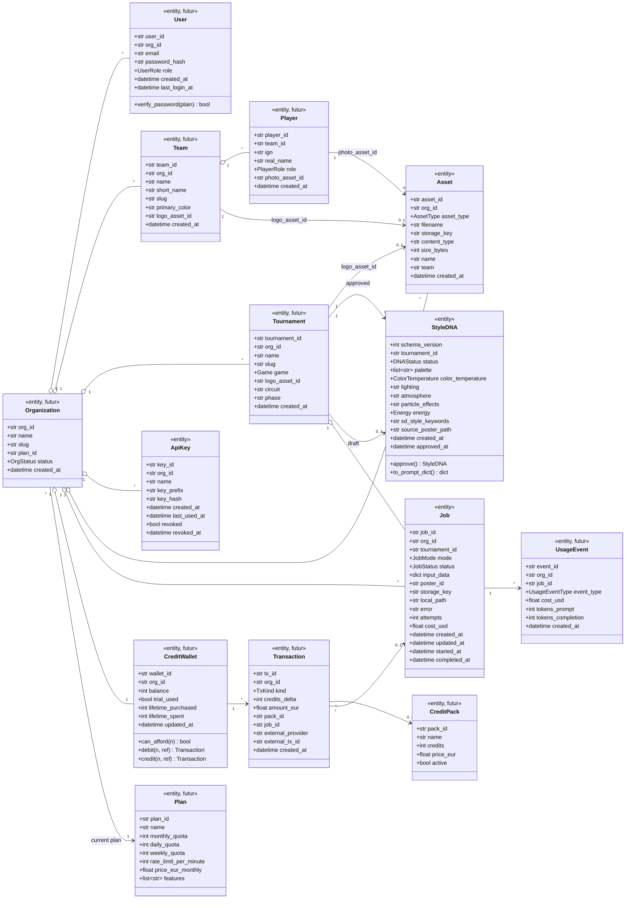
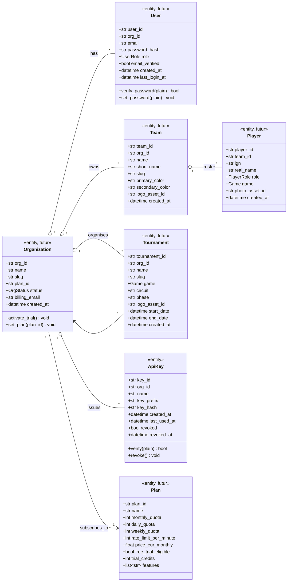
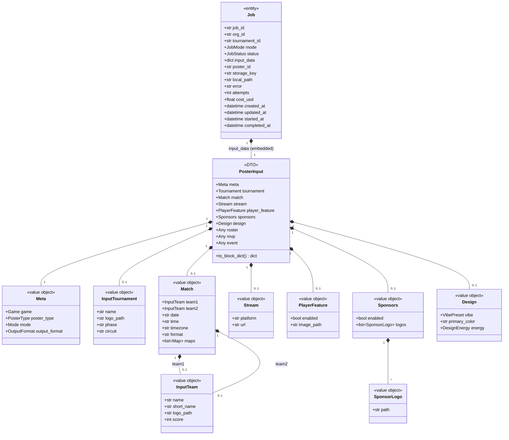
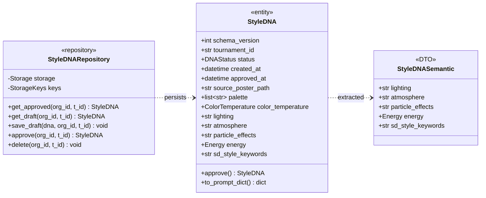
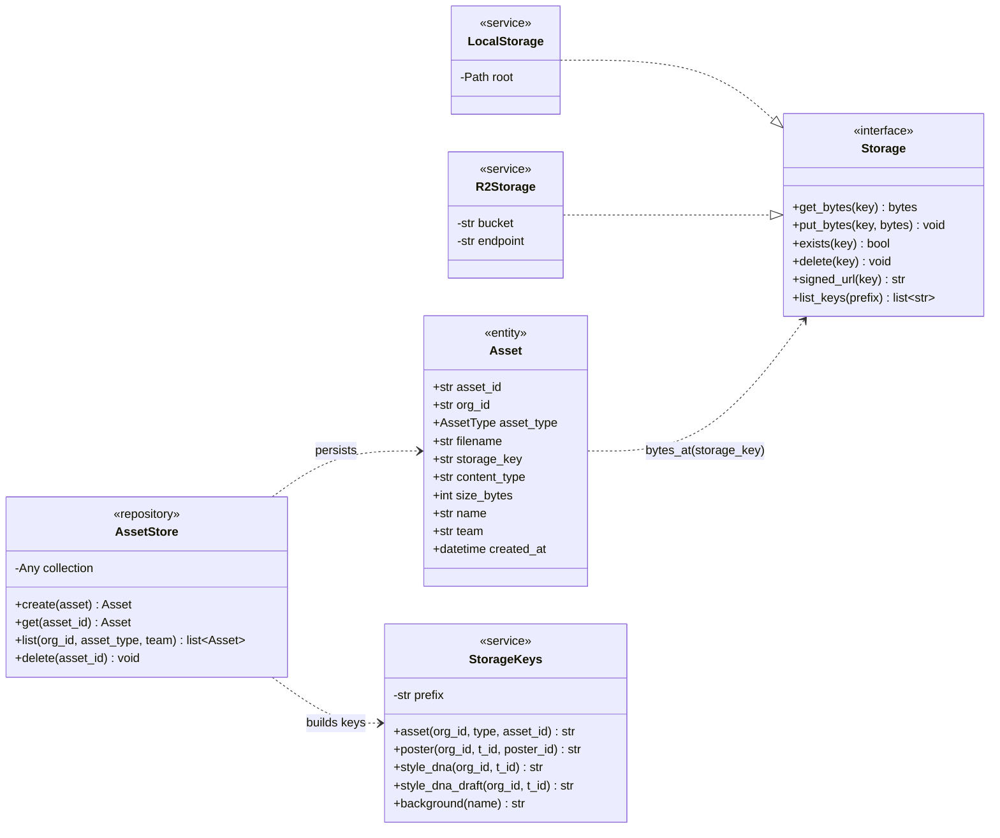
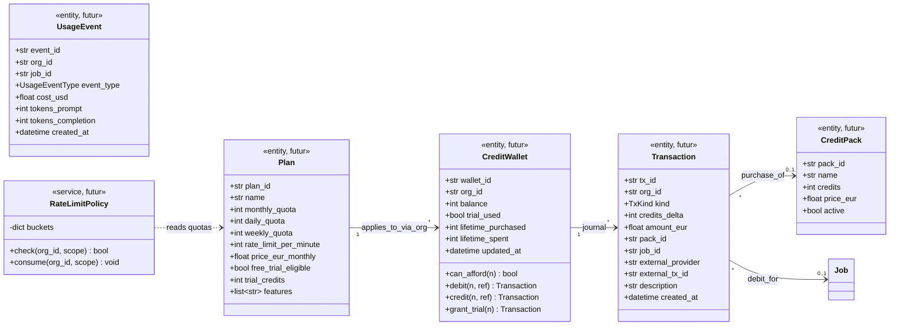

# Diagramme de classes — EsportsPostAI

> Ce document constitue le chapitre **Conception — Diagramme de classes** du rapport PFE. Il modélise le domaine métier *(entités actuelles et planifiées)*, leurs attributs typés, leurs méthodes clés et leurs relations.

---

## Table des matières

1. [Introduction et conventions](#1-introduction-et-conventions)
2. [Vue d'ensemble du domaine](#2-vue-densemble-du-domaine)
3. [Sous-diagramme — Multi-tenancy & Utilisateurs](#3-sous-diagramme--multi-tenancy--utilisateurs)
4. [Sous-diagramme — Génération de posters (Job + PosterInput)](#4-sous-diagramme--generation-de-posters)
5. [Sous-diagramme — Style DNA](#5-sous-diagramme--style-dna)
6. [Sous-diagramme — Bibliothèque de marque & Assets](#6-sous-diagramme--bibliotheque-de-marque)
7. [Sous-diagramme — Facturation & Crédits *(futur)*](#7-sous-diagramme--facturation--credits-futur)
8. [Catalogue des énumérations](#8-catalogue-des-enumerations)
9. [Tableaux détaillés par classe](#9-tableaux-detailles-par-classe)
10. [Récapitulatif des relations et cardinalités](#10-recapitulatif-des-relations-et-cardinalites)

---

## 1. Introduction et conventions

### 1.1 Périmètre

Ce diagramme couvre :

- les **classes actuellement implémentées** dans `src/esports_poster_ai/domain/` *(PosterInput et ses value objects, Job, Asset, ApiKey, StyleDNA)* ;
- les **entités planifiées** pour la base de données locale de test et pour la phase de monétisation *(Organization, User, Team, Player, Tournament, Plan, CreditWallet, CreditPack, Transaction, UsageEvent)*.

Les éléments futurs portent le stéréotype `«futur»` dans le diagramme et un statut explicite dans les tableaux.

### 1.2 Stéréotypes UML utilisés

| Stéréotype | Sémantique |
| --- | --- |
| `«entity»` | Objet métier avec identité persistante (a un identifiant primaire, vit dans une base de données). |
| `«value object»` | Objet sans identité, défini par ses valeurs (composant d'une entité, embarqué dans le document parent). |
| `«enum»` | Énumération de valeurs littérales. Représenté par `Literal[...]` en Python / Pydantic. |
| `«DTO»` | Data Transfer Object — modèle de transport (requête / réponse API, jamais persisté tel quel). |
| `«interface»` / `«protocol»` | Contrat structurel sans implémentation (équivalent du `typing.Protocol` Python). |
| `«futur»` | Classe ou attribut planifié, non encore implémenté. |

### 1.3 Notations Mermaid

| Relation | Syntaxe Mermaid | Sémantique UML |
| --- | --- | --- |
| Association | `A --> B` | A connaît B (référence simple). |
| Composition | `A *-- B` | B fait partie de A (cycle de vie lié). Si A est détruit, B aussi. |
| Agrégation | `A o-- B` | A référence B mais B peut vivre sans A. |
| Dépendance | `A ..> B` | A utilise B ponctuellement (paramètre, retour). |
| Réalisation | `A ..|> Interface` | A implémente l'interface. |
| Héritage | `Child --|> Parent` | Spécialisation. |
| Cardinalité | `A "1" --> "*" B` | Multiplicité (0, 1, *, 0..1, 1..*, etc.). |

### 1.4 Conventions de nommage

- Les **value objects** appartenant à `PosterInput` *(Match, Team, Tournament, Stream, Sponsors, Design)* sont nommés tels quels dans le code. Pour éviter toute confusion avec les **entités** futures du même nom *(Team entity, Tournament entity)*, le diagramme préfixe les value objects de `Input` dans la vue d'ensemble : `InputMatch`, `InputTeam`, `InputTournament`, etc.
- Les entités persistées portent le stéréotype `«entity»`.
- Les enums sont regroupés dans une section dédiée *(§8)*.

---

## 2. Vue d'ensemble du domaine

### 2.1 Description

Cette vue présente les principales **entités persistées** du système et leurs relations. Les value objects internes à `PosterInput` sont détaillés dans le sous-diagramme §4 ; les enums dans §8.

### 2.2 Diagramme Mermaid

> Le `PosterInput` n'apparaît pas comme entité persistée ici car il est embarqué dans `Job.input_data` (sérialisé en JSON). Il est détaillé en §4.

---

## 3. Sous-diagramme — Multi-tenancy & Utilisateurs

### 3.1 Description

Ce sous-diagramme regroupe les entités liées à l'**organisation cliente** *(Organization)*, à ses utilisateurs *(User)*, à ses équipes esports *(Team, Player)*, et à ses tournois *(Tournament)*. C'est le socle nécessaire pour passer d'un `org_id` opaque à un vrai modèle multi-tenant.

Toutes ces entités sont **futures** au sens où elles n'existent pas encore dans le code, mais elles seront ajoutées avec la base de données de test locale.

### 3.2 Diagramme Mermaid

### 3.3 Notes de conception

- **Identité opaque** : `org_id`, `user_id`, etc. sont des UUID hex (cohérence avec `uuid4().hex` déjà utilisé dans `Job`, `Asset`, `ApiKey`).
- **Slug** : `Organization.slug`, `Team.slug`, `Tournament.slug` sont des identifiants lisibles par l'humain (`ewc_2025`, `gng`, etc.) — c'est aux **slugs** que les `tournament_id` actuellement stockés dans le code font référence.
- **`logo_asset_id`** dans Team, Player, Tournament référence une ligne de la table `Asset` (uploadée via la bibliothèque de marque). C'est ainsi qu'on passe du champ `team` (string) actuel d'`Asset` à un vrai lien entité↔asset.
- **`UserRole`** : pour démarrer, trois rôles suffisent — `owner` (créateur de l'org, accès facturation), `admin` (gestion d'équipe et de tournois), `member` (création de posters seulement).

---

## 4. Sous-diagramme — Génération de posters

### 4.1 Description

Ce sous-diagramme détaille la classe `Job` *(entité persistée du job de génération)* et le contenu **embarqué** de son champ `input_data` — qui est validé via le modèle `PosterInput` à l'entrée. `PosterInput` est composé de plusieurs **value objects** typés.

### 4.2 Diagramme Mermaid

### 4.3 Notes de conception

- **`PosterInput` est un DTO**, pas une entité — il est validé à l'entrée, persisté en JSON dans `Job.input_data`, et ne vit pas indépendamment.
- **Composition stricte (`*--`)** : si le `Job` est détruit, son `input_data` l'est aussi. C'est volontaire — l'historique est conservé via le `Job`, pas séparément.
- **`logo_path` dans `InputTeam`, `InputTournament`, `SponsorLogo`, `PlayerFeature.image_path`** : ces strings sont **dual-mode** — soit un chemin local *(CLI)*, soit une clé R2 *(API)*. La résolution se fait dans `modes/fresh.py:_read_image`.
- **`maps: list[Any]`** est délibérément non typé — la structure varie selon le jeu *(Valorant a `map_name`, `rounds_team1`, `rounds_team2`)*. Un sous-modèle `MapResult` peut être ajouté quand la liste sera utilisée plus largement.

---

## 5. Sous-diagramme — Style DNA

### 5.1 Description

Le Style DNA est une entité persistée *(en JSON dans Cloudflare R2)* qui capture l'identité visuelle d'un tournoi. Il compose une partie **métadonnées + programmatique** *(palette)* et une partie **sémantique** *(extraite par GPT-4o)*.

### 5.2 Diagramme Mermaid

### 5.3 Notes de conception

- **`StyleDNASemantic` est un DTO d'extraction** — la classe minimale renvoyée par GPT-4o Vision via le schéma structuré. Elle est *fusionnée* dans `StyleDNA` avant persistance ; elle ne vit pas indépendamment en stockage.
- **`schema_version`** permet la rétrocompatibilité : les anciens DNA pré-versioning sont chargés en `schema_version=1` et marqués `approved` par défaut.
- **`approve()`** retourne une copie immuable avec le nouveau statut — pattern fonctionnel cohérent avec Pydantic.

---

## 6. Sous-diagramme — Bibliothèque de marque

### 6.1 Description

Le catalogue des assets visuels réutilisables. Une organisation possède des assets ; un asset est typé *(team-logos, player-images, sponsor-logos, tournament-logos, backgrounds)* et peut optionnellement être attaché à une équipe via le champ `team`.

### 6.2 Diagramme Mermaid

### 6.3 Notes de conception

- **`Storage` est un protocole** *(au sens `typing.Protocol`)* — pas une vraie classe d'héritage en Python, mais modélisé comme `«interface»` UML.
- **Deux implémentations** : `LocalStorage` pour le dev et les tests, `R2Storage` pour la production *(boto3 + endpoint S3 R2)*.
- **`StorageKeys` est la seule classe** où les clés d'objets sont formées — elle valide chaque segment de chemin pour éviter les attaques par traversée.
- **`Asset.team`** est un string libre aujourd'hui. Quand l'entité `Team` *(§3)* sera ajoutée, il deviendra un FK vers `Team.team_id`.

---

## 7. Sous-diagramme — Facturation & Crédits *(futur)*

### 7.1 Description

Ce sous-diagramme modélise les entités liées à la monétisation. Toutes sont marquées `«futur»`. Il couvre les plans tarifaires, les portefeuilles de crédits prépayés, les paquets achetables, le journal des transactions et le journal d'usage.

### 7.2 Diagramme Mermaid

### 7.3 Notes de conception

- **Wallet vs Transaction** : le `CreditWallet` n'est pas la source de vérité du solde — c'est le résultat agrégé du journal des `Transaction`. Le champ `balance` est un cache pour accélérer les lectures, recalculable depuis le journal en cas de désync.
- **`TxKind`** : énum couvrant `purchase` *(achat client)*, `debit` *(consommation à la fin d'un job)*, `trial_grant` *(activation essai gratuit)*, `manual_grant` *(geste commercial)*, `refund` *(remboursement)*.
- **`UsageEvent`** est distinct de `Transaction` : il décrit l'usage **technique** *(coût OpenAI réel en USD, tokens consommés)* tandis que la `Transaction` décrit le mouvement **commercial** *(crédits débités)*. Les deux sont liés au même `job_id` mais servent à deux dashboards différents *(coût réel pour l'admin, solde pour le client)*.
- **`RateLimitPolicy`** est un service technique, pas une entité persistée — les buckets sont des structures Redis vivantes. Il lit les quotas depuis `Plan` au démarrage.

---

## 8. Catalogue des énumérations

### 8.1 Énumérations actuelles

| Enum | Valeurs | Définie dans |
| --- | --- | --- |
| **Game** | `league_of_legends`, `valorant` | `domain/inputs.py` |
| **PosterType** | `gameday`, `game_results`, `roster_reveal`, `tournament_announcement`, `tournament_banner` | `domain/inputs.py` |
| **Mode** / **JobMode** | `fresh`, `consistency`, `refine` | `domain/inputs.py` / `domain/job.py` |
| **OutputFormat** | `portrait_1080x1920`, `square_1080x1080`, `landscape_1920x1080` | `domain/inputs.py` |
| **VibePreset** | `cyberpunk`, `cinematic`, `dark_fantasy`, `cosmic`, `minimal`, `fire_energy` | `domain/inputs.py` |
| **DesignEnergy** / **Energy** | `chill`, `balanced`, `intense`, `explosive` | `domain/inputs.py` / `domain/style_dna.py` |
| **ColorTemperature** | `warm`, `cool`, `neutral` | `domain/style_dna.py` |
| **DNAStatus** | `draft`, `approved` | `domain/style_dna.py` |
| **JobStatus** | `queued`, `generating_prompt`, `generating_poster`, `applying_sponsor_bar`, `completed`, `failed` | `domain/job.py` |
| **AssetType** | `team-logos`, `player-images`, `sponsor-logos`, `tournament-logos`, `backgrounds` | `storage/keys.py` |

### 8.2 Énumérations futures

| Enum | Valeurs proposées | Utilisation |
| --- | --- | --- |
| **UserRole** *(futur)* | `owner`, `admin`, `member` | Permissions au sein d'une `Organization` |
| **OrgStatus** *(futur)* | `active`, `suspended`, `trial`, `closed` | État commercial de l'organisation |
| **PlayerRole** *(futur)* | LoL : `top`, `jungle`, `mid`, `adc`, `support` — Valorant : `duelist`, `sentinel`, `controller`, `initiator`, `flex` | Rôle du joueur dans son équipe |
| **TxKind** *(futur)* | `purchase`, `debit`, `trial_grant`, `manual_grant`, `refund` | Type d'opération sur le wallet |
| **UsageEventType** *(futur)* | `poster_generated`, `prompt_generated`, `dna_extracted`, `refine_applied` | Type d'opération facturable |

### 8.3 Diagramme Mermaid des enums (compact)

```mermaid
classDiagram
  class Game { <<enum>> }
  class PosterType { <<enum>> }
  class Mode { <<enum>> }
  class OutputFormat { <<enum>> }
  class VibePreset { <<enum>> }
  class DesignEnergy { <<enum>> }
  class Energy { <<enum>> }
  class ColorTemperature { <<enum>> }
  class DNAStatus { <<enum>> }
  class JobStatus { <<enum>> }
  class AssetType { <<enum>> }
  class UserRole { <<enum, futur>> }
  class OrgStatus { <<enum, futur>> }
  class PlayerRole { <<enum, futur>> }
  class TxKind { <<enum, futur>> }
  class UsageEventType { <<enum, futur>> }
```

---

## 9. Tableaux détaillés par classe

### 9.1 `Organization` *(futur)*

| Attribut | Type | Description |
| --- | --- | --- |
| `org_id` | `str` (PK, UUID hex) | Identifiant opaque unique |
| `name` | `str` | Nom commercial *(« Defendr Esports »)* |
| `slug` | `str` (unique) | Identifiant lisible *(« defendr »)* — utilisé dans les URLs et clés R2 |
| `plan_id` | `str` (FK → Plan) | Plan tarifaire en cours |
| `status` | `OrgStatus` | `active`, `suspended`, `trial`, `closed` |
| `billing_email` | `str` | Adresse de facturation |
| `created_at` | `datetime` | Date de création |

**Méthodes :** `activate_trial()`, `set_plan(plan_id)`

### 9.2 `User` *(futur)*

| Attribut | Type | Description |
| --- | --- | --- |
| `user_id` | `str` (PK) | Identifiant utilisateur |
| `org_id` | `str` (FK → Organization) | Organisation d'appartenance |
| `email` | `str` (unique) | Adresse de connexion |
| `password_hash` | `str` | Hash bcrypt / argon2 |
| `role` | `UserRole` | `owner`, `admin`, `member` |
| `email_verified` | `bool` | Confirmation de l'email |
| `created_at` | `datetime` | Date d'inscription |
| `last_login_at` | `datetime?` | Dernière connexion |

**Méthodes :** `verify_password(plain) -> bool`, `set_password(plain)`

### 9.3 `Team` *(entité, futur)*

| Attribut | Type | Description |
| --- | --- | --- |
| `team_id` | `str` (PK) | Identifiant équipe |
| `org_id` | `str` (FK → Organization) | Organisation propriétaire |
| `name` | `str` | Nom complet *(« Gen.G Esports »)* |
| `short_name` | `str` | Abréviation *(« GNG »)* |
| `slug` | `str` | Identifiant URL-friendly *(« gng »)* |
| `primary_color` | `str` | Couleur de marque principale *(hex)* |
| `secondary_color` | `str` | Couleur de marque secondaire |
| `logo_asset_id` | `str` (FK → Asset) | Logo officiel de l'équipe |
| `created_at` | `datetime` | — |

### 9.4 `Player` *(futur)*

| Attribut | Type | Description |
| --- | --- | --- |
| `player_id` | `str` (PK) | Identifiant joueur |
| `team_id` | `str` (FK → Team) | Équipe d'appartenance |
| `ign` | `str` | In-game name *(« Faker »)* |
| `real_name` | `str?` | Nom civil |
| `role` | `PlayerRole` | Rôle dans l'équipe selon le jeu |
| `game` | `Game` | LoL ou Valorant *(certains pros jouent plusieurs jeux mais un slot = un jeu)* |
| `photo_asset_id` | `str?` (FK → Asset) | Photo officielle |
| `created_at` | `datetime` | — |

### 9.5 `Tournament` *(entité, futur — distincte du value object `InputTournament`)*

| Attribut | Type | Description |
| --- | --- | --- |
| `tournament_id` | `str` (PK) | Identifiant tournoi |
| `org_id` | `str` (FK → Organization) | Organisateur du tournoi |
| `name` | `str` | Nom complet *(« EWC 2025 »)* |
| `slug` | `str` | Identifiant lisible *(« ewc_2025 »)* — c'est ce slug qui sert de `tournament_id` dans le code actuel |
| `game` | `Game` | LoL ou Valorant |
| `circuit` | `str?` | Pour Valorant : « VCT EMEA », etc. |
| `phase` | `str?` | « Group Stage », « Playoffs », etc. |
| `logo_asset_id` | `str?` (FK → Asset) | Logo du tournoi |
| `start_date` | `datetime?` | Date de début |
| `end_date` | `datetime?` | Date de fin |
| `created_at` | `datetime` | — |

### 9.6 `Job` *(actuel)*

| Attribut | Type | Description |
| --- | --- | --- |
| `job_id` | `str` (PK, UUID hex) | Identifiant du job, généré par `uuid4().hex` |
| `org_id` | `str` (FK) | Organisation cliente |
| `tournament_id` | `str` (FK) | Tournoi cible |
| `mode` | `JobMode` | `fresh`, `consistency`, `refine` |
| `status` | `JobStatus` | État courant du job |
| `input_data` | `dict` | `PosterInput` sérialisé verbatim — embarqué pour rendre le worker autonome |
| `poster_id` | `str?` | Identifiant du poster produit *(rempli à `completed`)* |
| `storage_key` | `str?` | Clé R2 du poster *(rempli à `completed`)* |
| `local_path` | `str?` | Chemin local du poster *(copie locale)* |
| `error` | `str?` | Détail d'erreur *(rempli à `failed`)* |
| `attempts` | `int` | Nombre de tentatives effectuées |
| `cost_usd` | `float?` | Coût estimé du job, base du billing |
| `created_at` | `datetime` | Insertion en file |
| `updated_at` | `datetime` | Dernière transition de statut |
| `started_at` | `datetime?` | Premier appel du worker |
| `completed_at` | `datetime?` | Fin du job *(succès ou échec)* |

### 9.7 `Asset` *(actuel)*

| Attribut | Type | Description |
| --- | --- | --- |
| `asset_id` | `str` (PK, UUID hex) | Identifiant asset |
| `org_id` | `str` (FK) | Organisation propriétaire |
| `asset_type` | `AssetType` | Type d'asset *(team-logo, player-image, sponsor-logo, tournament-logo, background)* |
| `filename` | `str` | Nom du fichier original uploadé |
| `storage_key` | `str` | Clé R2 où vivent les bytes |
| `content_type` | `str` | MIME type |
| `size_bytes` | `int` | Taille en octets |
| `name` | `str?` | Libellé humain optionnel |
| `team` | `str?` | Équipe associée *(pour team-logos et player-images)* — string aujourd'hui, FK vers `Team` plus tard |
| `created_at` | `datetime` | — |

### 9.8 `ApiKey` *(actuel)*

| Attribut | Type | Description |
| --- | --- | --- |
| `key_id` | `str` (PK) | Identifiant de la clé |
| `org_id` | `str` (FK) | Organisation propriétaire |
| `name` | `str?` | Libellé *(« Defendr production », « Bot Discord »)* |
| `key_prefix` | `str` | ~12 premiers caractères du plaintext, pour la recherche rapide |
| `key_hash` | `str` | SHA-256 hex du plaintext complet |
| `created_at` | `datetime` | Date d'émission |
| `last_used_at` | `datetime?` | Dernière utilisation observée |
| `revoked` | `bool` | Statut de révocation *(soft-delete)* |
| `revoked_at` | `datetime?` | Date de révocation |

**Méthodes :** `verify(plain) -> bool`, `revoke()`

### 9.9 `StyleDNA` *(actuel)*

| Attribut | Type | Description |
| --- | --- | --- |
| `schema_version` | `int` | Version du schéma *(rétrocompat)* |
| `tournament_id` | `str` (FK) | Tournoi auquel la DNA appartient |
| `status` | `DNAStatus` | `draft` ou `approved` |
| `created_at` | `datetime` | Date d'extraction |
| `approved_at` | `datetime?` | Date d'approbation |
| `source_poster_path` | `str?` | Clé R2 du poster d'origine |
| `palette` | `list[str]` | Couleurs dominantes en hex, triées par fréquence |
| `color_temperature` | `ColorTemperature` | `warm`, `cool`, `neutral` |
| `lighting` | `str` | Description sémantique de la lumière |
| `atmosphere` | `str` | Description sémantique de l'atmosphère |
| `particle_effects` | `str` | Description sémantique des effets de particules |
| `energy` | `Energy` | Niveau d'énergie *(chill, balanced, intense, explosive)* |
| `sd_style_keywords` | `str` | Mots-clés style Stable Diffusion |

**Méthodes :** `approve() -> StyleDNA`, `to_prompt_dict() -> dict`

### 9.10 `Plan` *(futur)*

| Attribut | Type | Description |
| --- | --- | --- |
| `plan_id` | `str` (PK) | Identifiant du plan |
| `name` | `str` | « Free », « Pay-as-you-go », « Pro », « Enterprise » |
| `monthly_quota` | `int` | Posters max / mois |
| `daily_quota` | `int` | Posters max / jour |
| `weekly_quota` | `int` | Posters max / semaine |
| `rate_limit_per_minute` | `int` | Limite anti-abus |
| `price_eur_monthly` | `float` | Abonnement mensuel |
| `free_trial_eligible` | `bool` | Si l'essai gratuit est offert |
| `trial_credits` | `int` | Nombre de crédits offerts à l'essai |
| `features` | `list[str]` | Fonctionnalités incluses *(« webhook », « BYOK », « refine », etc.)* |

### 9.11 `CreditWallet` *(futur)*

| Attribut | Type | Description |
| --- | --- | --- |
| `wallet_id` | `str` (PK) | Identifiant wallet |
| `org_id` | `str` (FK, unique) | Une seule wallet par organisation |
| `balance` | `int` | Solde courant en crédits *(cache du journal)* |
| `trial_used` | `bool` | Si l'essai a déjà été activé |
| `lifetime_purchased` | `int` | Total acheté à ce jour |
| `lifetime_spent` | `int` | Total dépensé à ce jour |
| `updated_at` | `datetime` | Dernière mise à jour du cache |

**Méthodes :** `can_afford(n) -> bool`, `debit(n, ref) -> Transaction`, `credit(n, ref) -> Transaction`, `grant_trial(n) -> Transaction`

### 9.12 `CreditPack` *(futur)*

| Attribut | Type | Description |
| --- | --- | --- |
| `pack_id` | `str` (PK) | Identifiant du pack |
| `name` | `str` | « Starter », « Pro », « Studio » |
| `credits` | `int` | Nombre de crédits offerts |
| `price_eur` | `float` | Prix en EUR |
| `active` | `bool` | Si le pack est en vente |

### 9.13 `Transaction` *(futur)*

| Attribut | Type | Description |
| --- | --- | --- |
| `tx_id` | `str` (PK) | Identifiant transaction |
| `org_id` | `str` (FK) | Organisation concernée |
| `kind` | `TxKind` | `purchase`, `debit`, `trial_grant`, `manual_grant`, `refund` |
| `credits_delta` | `int` | Variation du solde *(positive = crédit, négative = débit)* |
| `amount_eur` | `float?` | Montant monétaire *(pour les achats / remboursements)* |
| `pack_id` | `str?` (FK → CreditPack) | Pack acheté *(si applicable)* |
| `job_id` | `str?` (FK → Job) | Job ayant causé le débit |
| `external_provider` | `str?` | « stripe », « paypal » |
| `external_tx_id` | `str?` | Identifiant côté fournisseur de paiement |
| `description` | `str` | Texte humain pour le journal |
| `created_at` | `datetime` | Horodatage |

### 9.14 `UsageEvent` *(futur)*

| Attribut | Type | Description |
| --- | --- | --- |
| `event_id` | `str` (PK) | Identifiant événement |
| `org_id` | `str` (FK) | Organisation concernée |
| `job_id` | `str` (FK → Job) | Job source de l'événement |
| `event_type` | `UsageEventType` | Type d'opération facturable |
| `cost_usd` | `float` | Coût réel OpenAI *(USD)* |
| `tokens_prompt` | `int?` | Tokens consommés en entrée *(GPT-4o)* |
| `tokens_completion` | `int?` | Tokens consommés en sortie |
| `created_at` | `datetime` | Horodatage |

---

## 10. Récapitulatif des relations et cardinalités

### 10.1 Relations principales

| De | Cardinalité | Vers | Sémantique |
| --- | --- | --- | --- |
| `Organization` | 1 → * | `User` | Une org a plusieurs utilisateurs |
| `Organization` | 1 → * | `Team` | Une org possède plusieurs équipes |
| `Organization` | 1 → * | `Tournament` | Une org organise plusieurs tournois |
| `Organization` | 1 → * | `ApiKey` | Une org possède plusieurs clés API |
| `Organization` | 1 → * | `Asset` | Une org possède plusieurs assets |
| `Organization` | 1 → * | `Job` | Une org soumet plusieurs jobs |
| `Organization` | 1 → 1 | `CreditWallet` | Un seul wallet par org |
| `Organization` | * → 1 | `Plan` | Une org est abonnée à un plan |
| `Team` | 1 → * | `Player` | Une équipe a plusieurs joueurs |
| `Team` | 1 → 0..1 | `Asset` | Logo officiel (FK `logo_asset_id`) |
| `Player` | 1 → 0..1 | `Asset` | Photo officielle (FK `photo_asset_id`) |
| `Tournament` | 1 → 0..1 | `Asset` | Logo du tournoi |
| `Tournament` | 1 → 0..1 | `StyleDNA` | DNA approuvée *(au plus une par tournoi)* |
| `Tournament` | 1 → 0..1 | `StyleDNA` | DNA brouillon |
| `Tournament` | 1 → * | `Job` | Jobs liés à ce tournoi |
| `Job` | 1 → 1 | `PosterInput` *(embedded)* | Composition stricte |
| `Job` | 1 → * | `UsageEvent` | Coûts techniques |
| `CreditWallet` | 1 → * | `Transaction` | Journal des opérations |
| `Transaction` | * → 0..1 | `CreditPack` | Achat lié à un pack |
| `Transaction` | * → 0..1 | `Job` | Débit lié à un job |

### 10.2 Compositions de `PosterInput`

| De | Cardinalité | Vers |
| --- | --- | --- |
| `PosterInput` | 1 → 1 | `Meta` |
| `PosterInput` | 1 → 0..1 | `InputTournament` |
| `PosterInput` | 1 → 0..1 | `Match` |
| `PosterInput` | 1 → 0..1 | `Stream` |
| `PosterInput` | 1 → 0..1 | `PlayerFeature` |
| `PosterInput` | 1 → 0..1 | `Sponsors` |
| `PosterInput` | 1 → 0..1 | `Design` |
| `Match` | 1 → 0..1 | `InputTeam` *(team1)* |
| `Match` | 1 → 0..1 | `InputTeam` *(team2)* |
| `Sponsors` | 1 → * | `SponsorLogo` |

### 10.3 Réalisations / interfaces

| Classe | Réalise | Notes |
| --- | --- | --- |
| `LocalStorage` | `Storage` | Backend filesystem pour dev / tests |
| `R2Storage` | `Storage` | Backend Cloudflare R2 pour la prod |

### 10.4 Évolution des champs *(actuel → futur)*

Pour mémoire dans le rapport, voici les **transformations d'attributs** qui surviendront quand les entités futures seront ajoutées :

| Aujourd'hui | Demain |
| --- | --- |
| `Job.org_id: str` | Reste `str` (FK vers `Organization.org_id`) |
| `Job.tournament_id: str` | Reste `str` (FK vers `Tournament.tournament_id`) |
| `Asset.team: str?` | Devient `team_id: str?` (FK vers `Team.team_id`) |
| `InputTeam.logo_path: str?` | Devient `logo_asset_id: str?` (FK vers `Asset`) — la résolution dual-mode disparaît |
| `InputTournament.logo_path: str?` | Idem |
| `SponsorLogo.path: str` | Devient `asset_id: str` (FK) |
| `PlayerFeature.image_path: str?` | Idem |

Ces évolutions sont compatibles avec les structures actuelles *(les strings restent acceptés en transition)*. Elles seront opérées progressivement, sans rupture.

---

*Fin du document — Diagramme de classes*
