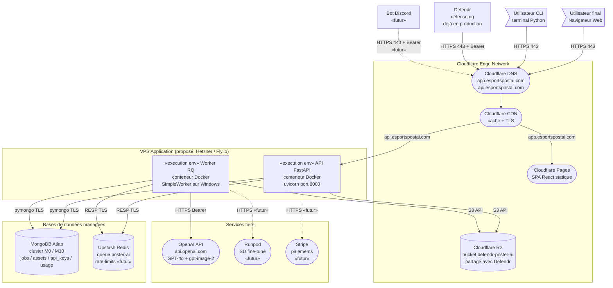
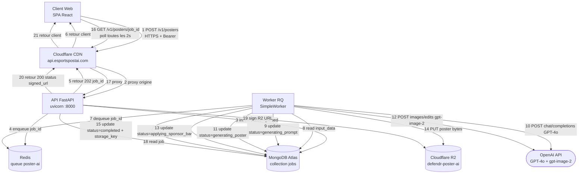
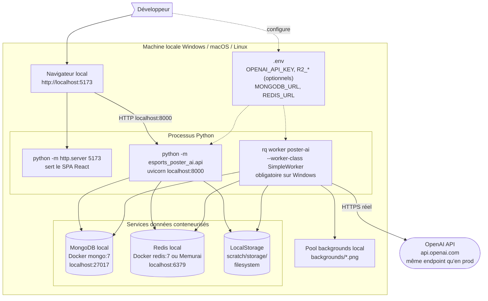

# Diagramme de déploiement — EsportsPostAI

> Ce document constitue le chapitre **Conception — Diagramme de déploiement** du rapport PFE. Il décrit la **topologie physique** du système : où chaque composant logiciel s'exécute, comment les nœuds communiquent, et avec quels protocoles. Le diagramme intègre **Defendr** comme premier consommateur externe (déjà déployé à <https://defendr.gg>).
>
> Trois diagrammes sont présentés :
>
> 1. **Vue d'ensemble de la production** — topologie physique complète du système.
> 2. **Flux d'une requête type *(séquence)*** — vue dynamique qui illustre comment les nœuds collaborent.
> 3. **Environnement de développement local** — version locale du système pour le dev et les tests.

---

## Table des matières

1. [Introduction et conventions](#1-introduction-et-conventions)
2. [Diagramme 1 — Architecture de production](#2-diagramme-1--architecture-de-production)
3. [Diagramme 2 — Flux d'une requête type *(séquence)*](#3-diagramme-2--flux-dune-requete-type-sequence)
4. [Diagramme 3 — Environnement de développement local](#4-diagramme-3--environnement-de-developpement-local)
5. [Catalogue détaillé des nœuds](#5-catalogue-detaille-des-noeuds)
6. [Catalogue des communications](#6-catalogue-des-communications)
7. [Sécurité, scalabilité et observabilité](#7-securite-scalabilite-et-observabilite)
8. [Roadmap d'évolution du déploiement](#8-roadmap-devolution-du-deploiement)

---

## 1. Introduction et conventions

### 1.1 Périmètre

Le système EsportsPostAI est déployé selon une architecture **cloud-native trois-tiers** :

1. **Couche client** : navigateurs Web *(SPA React)*, terminaux CLI Python, et systèmes externes *(Defendr, bot Discord futur)*.
2. **Couche application** : API FastAPI et worker RQ, containerisés sur un VPS *(proposé : Hetzner Cloud, Fly.io ou DigitalOcean)*.
3. **Couche données** : MongoDB *(proposé : Atlas)*, Redis *(proposé : Upstash)*, Cloudflare R2 *(déjà actif en production)*.

Les services externes invoqués sont **OpenAI** *(GPT-4o + gpt-image-2, déjà en production)*, **Runpod** *(stub planifié)* et **Stripe** *(monétisation planifiée)*.

> **Note** : Certains choix d'hébergement *(fournisseur du VPS, du Redis, du Mongo)* sont des **propositions** que le rapport final peut substituer par les fournisseurs réellement retenus. Ils sont signalés explicitement par « *proposé* » dans le texte.

### 1.2 Conventions UML pour les diagrammes de déploiement

| Stéréotype | Sémantique |
| --- | --- |
| `«device»` | Périphérique physique *(serveur, ordinateur, mobile)*. |
| `«execution environment»` | Environnement d'exécution *(container, runtime)*. |
| `«artifact»` | Élément déployé *(image Docker, bundle JS)*. |
| `«cloud service»` | Service managé externe *(SaaS, PaaS, IaaS)*. |
| Trait plein entre nœuds | Lien réseau. |
| Étiquette `«HTTPS»`, `«TCP»` | Protocole de communication. |
| Stéréotype `«futur»` | Composant planifié, non encore déployé. |

### 1.3 Conventions Mermaid utilisées

Mermaid n'ayant pas de syntaxe UML native pour le déploiement, nous utilisons la syntaxe `graph` avec ces conventions visuelles :

| Forme | Représente |
| --- | --- |
| `subgraph` | Frontière d'un nœud de déploiement ou d'une zone réseau |
| `[Texte]` | Processus ou conteneur déployé |
| `[(Texte)]` | Base de données / stockage persistant |
| `([Texte])` | Service managé externe |
| `>Texte]` | Acteur humain |

---

## 2. Diagramme 1 — Architecture de production

### 2.1 Description

Cette vue montre l'**ensemble physique** du système en production : les acteurs externes *(utilisateurs, Defendr, bot Discord futur)*, la couche edge Cloudflare *(DNS, CDN, Pages, R2)*, la couche application *(API + Worker containerisés)*, la couche données *(MongoDB Atlas, Upstash Redis)*, et les services tiers *(OpenAI, Runpod futur, Stripe futur)*.

Le **bucket R2 est partagé avec Defendr** *(préfixe `defendr-poster-ai/` utilisé comme convention de namespacing)* — cette particularité est documentée dans la limitation §7.4.

### 2.2 Diagramme



### 2.3 Lecture rapide

- **Trois entrées convergent** sur Cloudflare DNS : navigateur Web, CLI Python locale, et Defendr en server-to-server.
- **Cloudflare termine le TLS** et route par sous-domaine : `app.*` vers Pages *(SPA statique)*, `api.*` vers le VPS d'application.
- **API et Worker** partagent le même VPS au lancement *(option simplifiée)* mais sont des **conteneurs distincts**, scalables indépendamment.
- **Le Worker n'est jamais exposé sur Internet** : il ne fait que lire la file Redis et écrire dans MongoDB et R2. Aucun port entrant ne lui est ouvert.
- **Tous les liens externes sont en HTTPS** avec TLS 1.2+ et authentification *(Bearer pour l'API, IAM pour R2, SCRAM/TLS pour Mongo, token + TLS pour Upstash)*.
- **Le bucket R2** est nommé `defendr-poster-ai` car partagé avec Defendr ; le préfixe top-level sert de namespace organisationnel — voir limitation §7.4.

---

## 3. Diagramme 2 — Flux d'une requête type *(séquence)*

### 3.1 Description

Ce diagramme montre la **vue dynamique** : comment une requête typique *(soumission d'un poster suivi de son polling)* traverse l'ensemble des nœuds du diagramme statique. Il prouve la cohérence de l'architecture en explicitant chaque appel réseau et chaque écriture en base.

Le flux illustre les deux phases distinctes :

- **Phase synchrone *(non-bloquante)*** : 6 étapes, retour client en ~50 ms.
- **Phase asynchrone *(traitement par le worker)*** : 12 étapes, durée 20-60 s selon le pipeline.
- **Phase de polling client** : le SPA poll l'état toutes les 2 secondes jusqu'à `completed`.

### 3.2 Diagramme



### 3.3 Lecture pas à pas

| Étapes | Phase | Description |
| --- | --- | --- |
| 1–6 | **Synchrone** | Soumission : le client POST le JSON, l'API valide via `PosterInput`, persiste le job en `queued`, enqueue dans Redis, renvoie un `202 job_id` immédiatement *(latence client ~50 ms)*. |
| 7–8 | **Asynchrone, démarrage** | Le worker dequeue le `job_id`, lit le document complet depuis MongoDB. |
| 9–12 | **Asynchrone, génération** | Pipeline : transitions de statut + 2 appels OpenAI séquentiels *(prompt puis image)*. Durée dominante : 15–45 s. |
| 13–15 | **Asynchrone, finalisation** | Composition optionnelle de la barre des sponsors *(Pillow)*, écriture du PNG dans R2, marquage du job comme `completed`. |
| 16–21 | **Polling client** | Le SPA poll l'API toutes les 2 s ; quand `completed`, l'API signe une URL R2 pré-signée et la renvoie. Le client affiche l'image directement depuis R2. |

### 3.4 Caractéristiques mises en évidence

- **Non-bloquant** : la phase synchrone ne dépasse jamais quelques dizaines de millisecondes.
- **Persistance double** : Redis sert uniquement de transport *(la file)*, MongoDB est le système de vérité *(l'historique reste si Redis tombe)*.
- **Sortie agnostique du transport** : le client ne télécharge pas le poster depuis l'API mais directement depuis R2 via URL signée — l'API ne sert jamais d'octets d'image.
- **Idempotence** : un worker qui crashe entre les étapes 12 et 13 peut être relancé sur le même `job_id` sans corruption *(la transition de statut est l'unité de progrès)*.
- **Tolérance aux pannes** : la file RQ persiste les jobs pendant le crash d'un worker ; ils sont repris automatiquement.

---

## 4. Diagramme 3 — Environnement de développement local

### 4.1 Description

L'environnement local reproduit l'intégralité du système sur une seule machine, **sans dépendance cloud** (sauf l'API OpenAI qui reste réelle pour valider le pipeline bout-en-bout). Cette capacité repose sur deux abstractions clés introduites pendant le refactoring :

- **`Storage` est un protocole** : `LocalStorage` se substitue à `R2Storage` sans changement de code applicatif.
- **`get_settings()`** : toute la configuration vient d'un fichier `.env`, jamais en dur.

Cette équivalence prod/dev est ce qui justifie l'abstraction du module `storage/` et la centralisation de la configuration dans `config.py`.

### 4.2 Diagramme



### 4.3 Différences clés avec la production

| Composant | Production | Développement local |
| --- | --- | --- |
| Frontend | Cloudflare Pages *(app.esportspostai.com)* | `python -m http.server 5173` |
| API | VPS containerisé *(HTTPS 443)* | `python -m esports_poster_ai.api` *(HTTP localhost:8000)* |
| Worker | Container Docker Linux | `rq worker poster-ai --worker-class rq.SimpleWorker` *(forcé sur Windows car RQ utilise `os.fork()` par défaut)* |
| MongoDB | Atlas managé | `docker run -p 27017:27017 mongo:7` |
| Redis | Upstash managé | `docker run -p 6379:6379 redis:7` ou Memurai sur Windows |
| Stockage objet | `R2Storage` *(boto3 → Cloudflare R2)* | `LocalStorage` rooté à `scratch/storage/` |
| Backgrounds | Pool R2 *(à migrer)* | Dossier local `backgrounds/` *(images PNG originales)* |
| Secrets | Variables d'env du fournisseur cloud | Fichier `.env` *(jamais commité)* |
| TLS | Cloudflare Origin Certificate | HTTP en clair sur localhost |
| Domaine | `*.esportspostai.com` | `localhost:5173` + `localhost:8000` |

### 4.4 Notes pratiques

- **L'API OpenAI reste réelle** : on n'utilise pas de mock en dev pour valider le pipeline bout-en-bout. Le garde-fou `STAGE2_BUDGET_USD` limite l'exposition financière en cas de boucle accidentelle.
- **Variables R2 facultatives en dev** : si les quatre variables `R2_*` ne sont pas définies, `get_storage()` retourne automatiquement `LocalStorage`. Aucun changement de code n'est nécessaire.
- **CORS activé** : le middleware CORS de FastAPI est configuré avec `allow_origins=["*"]` pour permettre au SPA servi depuis `:5173` d'appeler l'API sur `:8000`.
- **Tests** : `pytest` couvre les modules déterministes *(router, assembler, storage keys, sponsor bar, DNA repository)* sans réseau ni OpenAI. Aucun service externe requis pour la CI.

---

## 5. Catalogue détaillé des nœuds

> Les sections suivantes consolident en tableaux les informations sur chaque nœud du diagramme de production *(§2)*. Elles remplacent les sous-diagrammes spécialisés pour éviter une multiplication inutile de schémas dans le rapport.

### 5.1 Nœuds clients

| Nœud | Stéréotype | Localisation | Fournisseur | Rôle |
| --- | --- | --- | --- | --- |
| Navigateur Web | `«device»` | Côté utilisateur | — | Exécute le SPA React |
| Terminal CLI | `«device»` | Côté utilisateur ou serveur d'automation | — | Exécute la CLI Python |
| Defendr backend | `«device»` | Hébergement Defendr *(non géré par EsportsPostAI)* | <https://défense.gg> *(déjà en production)* | Consomme l'API en server-to-server |
| Bot Discord *(futur)* | `«device»` | Hébergement client tenant | À définir | Slash command `/poster` |

### 5.2 Nœuds Cloudflare

| Nœud | Stéréotype | Coût mensuel | Rôle |
| --- | --- | --- | --- |
| Cloudflare DNS | `«cloud service»` | 0 € *(plan gratuit)* | Résolution `*.esportspostai.com` |
| Cloudflare CDN | `«cloud service»` | 0 € *(plan gratuit)* | Cache + TLS termination + protection DDoS basique |
| Cloudflare Pages | `«cloud service»` | 0 € *(jusqu'à 500 builds/mois)* | Hébergement statique du SPA |
| Cloudflare R2 | `«cloud service»` | $0.015 / Go-mois + zéro frais d'egress | Stockage objet S3-compatible *(bucket `defendr-poster-ai`)* |

### 5.3 Nœuds applicatifs

| Nœud | Stéréotype | Fournisseur proposé | Coût mensuel | Rôle |
| --- | --- | --- | --- | --- |
| Conteneur API | `«execution environment»` | Hetzner CX11 / Fly.io | ~5 € | Sert les endpoints `/v1/*` |
| Conteneur Worker | `«execution environment»` | Même VPS | inclus | Exécute le pipeline de génération |
| Reverse proxy *(Caddy / Traefik)* | `«execution environment»` | Même VPS | inclus | TLS + routage HTTPS |

**Spécifications VPS proposé** : 2 vCPU, 4 Go RAM, 40 Go SSD, Ubuntu 22.04 LTS, Docker + Docker Compose, coût ~5–15 € / mois.

### 5.4 Nœuds de données

| Nœud | Stéréotype | Fournisseur proposé | Coût mensuel | Rôle |
| --- | --- | --- | --- | --- |
| MongoDB Atlas | `«cloud service»` | MongoDB | 0 € *(M0)* puis ~$9 *(M10)* | Système de vérité *(jobs, assets, api_keys, usage_events)* |
| Upstash Redis | `«cloud service»` | Upstash | 0 € *(jusqu'à 10 000 commandes/jour)* | Transport file RQ + futurs rate-limits |
| Cloudflare R2 | `«cloud service»` | Cloudflare | Pay-as-you-go | Stockage objet partagé avec Defendr |

**Collections MongoDB utilisées** : `jobs`, `assets`, `api_keys`, `usage_events` *(actif)* ; `organizations`, `users`, `teams`, `players`, `tournaments`, `credit_wallets`, `transactions`, `credit_packs` *(futur — voir diagramme de classes)*.

**Layout du bucket R2** :
```
defendr-poster-ai/
├── orgs/{org_id}/
│   ├── assets/{asset_type}/{asset_id}.png
│   └── tournaments/{tournament_id}/
│       ├── style-dna.json
│       ├── style-dna.draft.json
│       └── posters/{poster_id}.png
└── system/backgrounds/{name}
```

### 5.5 Services IA et tiers

| Nœud | Stéréotype | Fournisseur | Mode de facturation | Rôle |
| --- | --- | --- | --- | --- |
| OpenAI API | `«cloud service»` | OpenAI | Per-call | Génération du prompt *(GPT-4o, ~$0.008)* et de l'image *(gpt-image-2, ~$0.046)* |
| Runpod *(futur)* | `«cloud service»` | Runpod | Per-second compute | Génération de backgrounds par Stable Diffusion fine-tuné |
| Stripe *(futur)* | `«cloud service»` | Stripe | % par transaction | Paiements des packs de crédits |

**Coût OpenAI moyen par poster** : ~$0.054 *(GPT-4o + gpt-image-2 medium)*. **Choix stratégique** : la clé OpenAI est **centralisée** côté plateforme *(pas BYOK)*, ce qui permet l'essai gratuit et les crédits prépayés.

---

## 6. Catalogue des communications

| # | Source | Destination | Protocole | Port | Authentification | Statut |
| --- | --- | --- | --- | --- | --- | --- |
| 1 | Navigateur Web | Cloudflare CDN | HTTPS / HTTP/2 | 443 | TLS 1.2+, session future | Actuel |
| 2 | Terminal CLI | Cloudflare CDN | HTTPS | 443 | `.env` local | Actuel *(via dev)* |
| 3 | Defendr backend | Cloudflare CDN *(api.*)* | HTTPS | 443 | `Authorization: Bearer <api_key>` | Actuel |
| 4 | Bot Discord *(futur)* | Cloudflare CDN *(api.*)* | HTTPS | 443 | `Authorization: Bearer <api_key>` | Futur |
| 5 | Cloudflare CDN | Cloudflare Pages | interne Cloudflare | — | — | Actuel |
| 6 | Cloudflare CDN | VPS d'application | HTTPS | 443 → 8000 | Cloudflare Origin Certificate | Actuel |
| 7 | API FastAPI | MongoDB Atlas | MongoDB Wire + TLS | 27017 | SCRAM-SHA-256 + TLS | Actuel |
| 8 | API FastAPI | Upstash Redis | RESP + TLS | 6379 | Token Upstash + TLS | Actuel |
| 9 | API FastAPI | Cloudflare R2 | HTTPS / S3 API | 443 | IAM token R2 | Actuel |
| 10 | Worker RQ | MongoDB Atlas | MongoDB Wire + TLS | 27017 | SCRAM-SHA-256 + TLS | Actuel |
| 11 | Worker RQ | Upstash Redis | RESP + TLS | 6379 | Token Upstash + TLS | Actuel |
| 12 | Worker RQ | Cloudflare R2 | HTTPS / S3 API | 443 | IAM token R2 | Actuel |
| 13 | Worker RQ | OpenAI API | HTTPS | 443 | `Authorization: Bearer OPENAI_API_KEY` | Actuel |
| 14 | Worker RQ | Runpod *(futur)* | HTTPS | 443 | `Authorization: Bearer RUNPOD_API_KEY` | Futur |
| 15 | API FastAPI | Stripe *(futur)* | HTTPS | 443 | `Authorization: Bearer STRIPE_SECRET_KEY` | Futur |
| 16 | Stripe *(futur)* | API FastAPI *(webhook)* | HTTPS | 443 | Signature `Stripe-Signature` | Futur |

---

## 7. Sécurité, scalabilité et observabilité

### 7.1 Sécurité

| Préoccupation | Mesure |
| --- | --- |
| TLS bout-en-bout | Cloudflare Origin Certificate entre Cloudflare et le VPS ; TLS 1.2+ partout |
| Authentification API | Clés API hachées SHA-256 ; plaintext renvoyé une seule fois à l'émission |
| Authentification admin | `ADMIN_TOKEN` en variable d'env, jamais journalisé |
| Secrets en production | Variables d'env injectées par le fournisseur *(Fly.io secrets, Hetzner cloud-init)* — jamais commités |
| Isolation tenant | `org_id` propage sur chaque écriture ; middleware d'extraction Bearer → contexte *(en cours)* |
| Validation des entrées | `PosterInput` Pydantic strict sur `_meta` ; rejet de toute entrée non conforme |
| Protection des paths R2 | `StorageKeys` valide chaque segment contre les traversées *(`..`, `/`, `\\`)* |
| Protection DDoS | Cloudflare CDN niveau gratuit *(suffisant au démarrage)* |

### 7.2 Scalabilité

| Composant | Stratégie de scaling |
| --- | --- |
| API FastAPI | **Horizontal** — stateless ; N conteneurs derrière un load balancer Cloudflare ou Caddy |
| Worker RQ | **Horizontal** — chaque worker prend un job à la fois ; ajouter des conteneurs augmente le débit |
| MongoDB Atlas | **Vertical d'abord** *(M0 → M10 → M20)*, shard horizontal plus tard *(non nécessaire sous 100 k jobs/mois)* |
| Upstash Redis | Scaling automatique sans serveur *(pay-per-request)* |
| R2 | Scaling transparent, illimité côté Cloudflare |
| OpenAI | Quota du compte ; éligible upgrade de Tier *(usage > $10/mois)* |

### 7.3 Observabilité

| Préoccupation | Solution actuelle | Solution future |
| --- | --- | --- |
| Logs structurés | Logging Python standard, `run_id` 12-char par appel OpenAI | Agrégation centralisée *(Grafana Loki, Datadog, Axiom)* |
| Métriques | Endpoint `/health` *(Mongo + Redis)* | Métriques Prometheus *(latence p95, profondeur de file, taux d'erreur)* |
| Alertes | Aucune | Alerte sur profondeur de file > N, taux d'erreur > X% |
| Tracing | Aucun | OpenTelemetry sur les appels OpenAI |
| Dashboard utilisateur | Tableau de bord SPA *(jobs en cours)* | Dashboard admin `/admin/usage` *(futur)* |

### 7.4 Limitations connues

- **Isolation R2** : les tokens R2 sont scopés au bucket *(pas au préfixe)*. Un token utilisé par EsportsPostAI a accès théorique à tout `defendr-poster-ai/`, y compris les objets de Defendr. La discipline est imposée par `StorageKeys` *(unique point de formation des clés)*. Un bucket dédié est envisagé à long terme.
- **Worker single-process sur Windows** *(`SimpleWorker` car RQ utilise `os.fork()` par défaut)*. En production sous Linux, le worker forké standard permet plus de concurrence.
- **Pas de retry distinct sur 429 OpenAI** : un burst de rate-limit consomme rapidement les 3 retries du backoff exponentiel. Honorer `Retry-After` est une amélioration prévue.

---

## 8. Roadmap d'évolution du déploiement

### 8.1 Court terme *(Phases 5 et 6 — multi-tenancy et Defendr)*

| Étape | Objectif |
| --- | --- |
| Provisionner le VPS *(Hetzner / Fly.io)* | Première mise en production |
| Configurer le DNS Cloudflare *(app, api)* | Domaine de production opérationnel |
| Migrer le pool de backgrounds vers R2 *(`system/backgrounds/`)* | Suppression de la dépendance au filesystem local |
| Middleware d'auth Bearer → `org_id` injecté | Sécurise l'API pour les premiers tenants |
| Webhooks Defendr | Push de fin de job au lieu du polling client |

### 8.2 Moyen terme *(Phase 7 — Monétisation)*

| Étape | Objectif |
| --- | --- |
| Intégration Stripe | Achats de crédits prépayés |
| Rate limiting Redis | Token buckets par org / minute / heure |
| Quota commercial | Vérifications par jour / semaine / mois |
| Dashboard admin `/admin/usage` | Facturation et supervision client |
| Migration Runpod | Backgrounds générés par IA *(quand `background.source = "generated"`)* |

### 8.3 Long terme

| Étape | Objectif |
| --- | --- |
| Multi-région *(Cloudflare + Fly.io)* | Latence réduite hors EU |
| Bucket R2 dédié | Vraie isolation tenant *(plutôt que préfixe partagé)* |
| CI/CD complet *(GitHub Actions → Fly.io)* | Déploiement automatisé sur merge `main` |
| Blue/green deploy | Mises à jour sans downtime |
| BYOK *(Bring Your Own Key)* pour Enterprise | Clients à fort volume utilisent leur propre quota OpenAI |
| Mode multi-output drafts | Génération en quality="low" puis upscale |

---

*Fin du document — Diagramme de déploiement*
