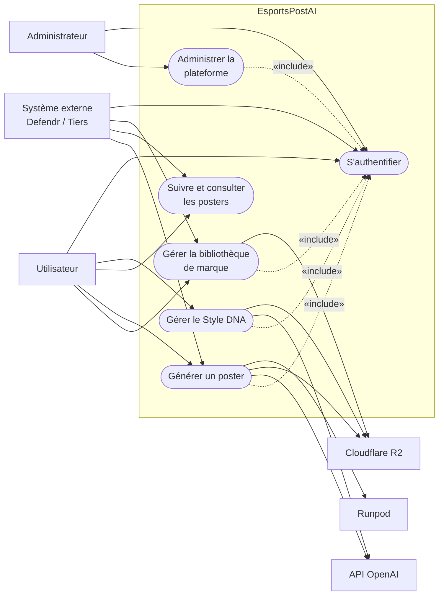
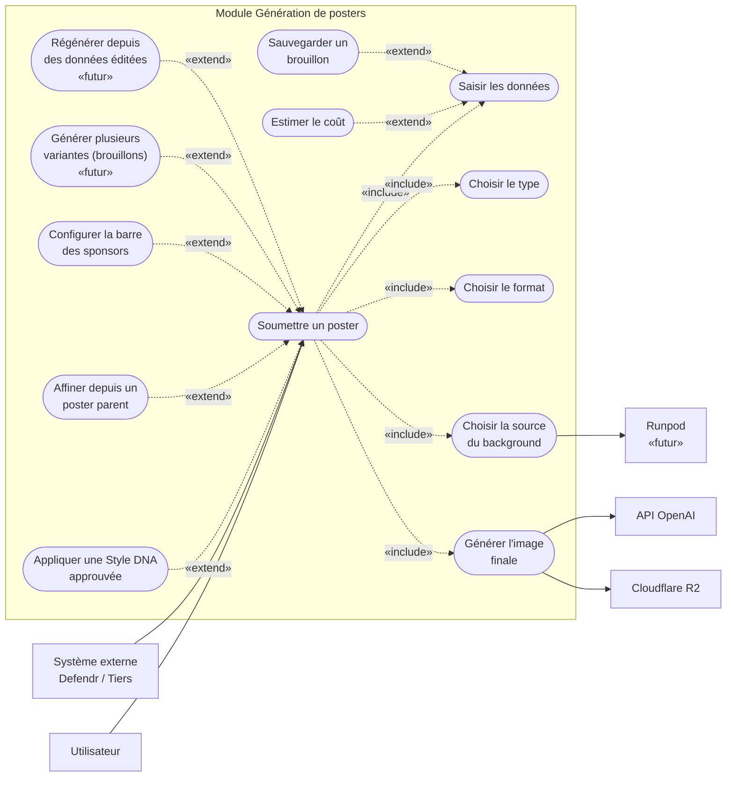
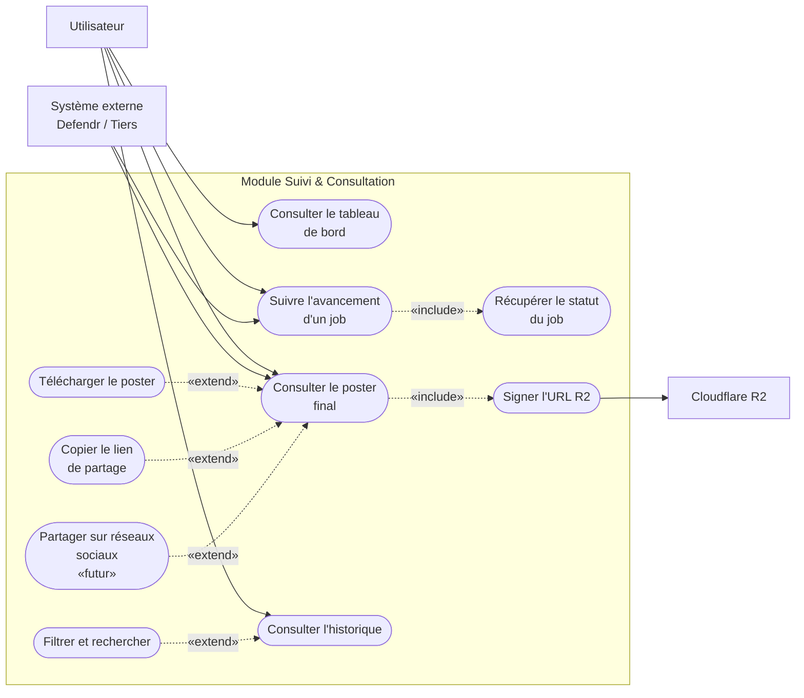
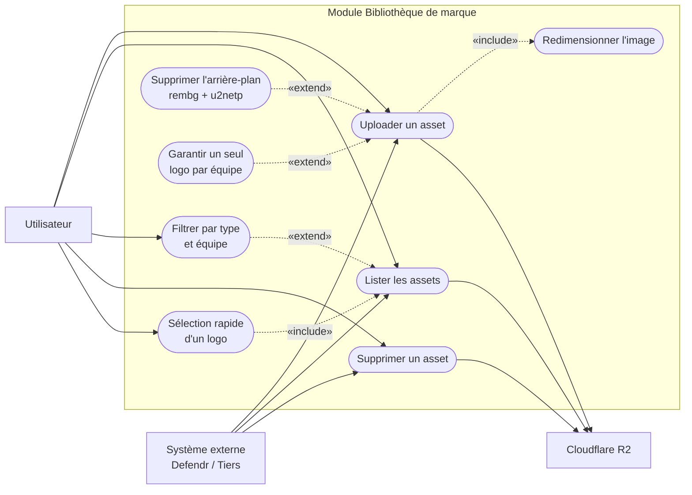
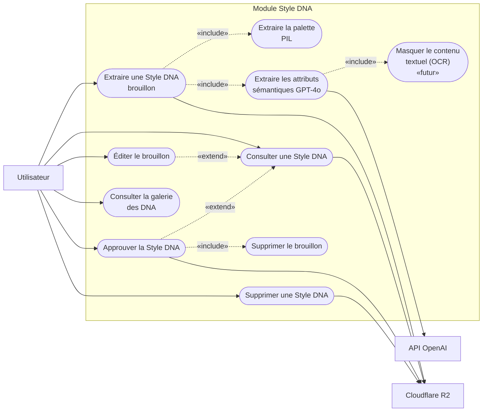
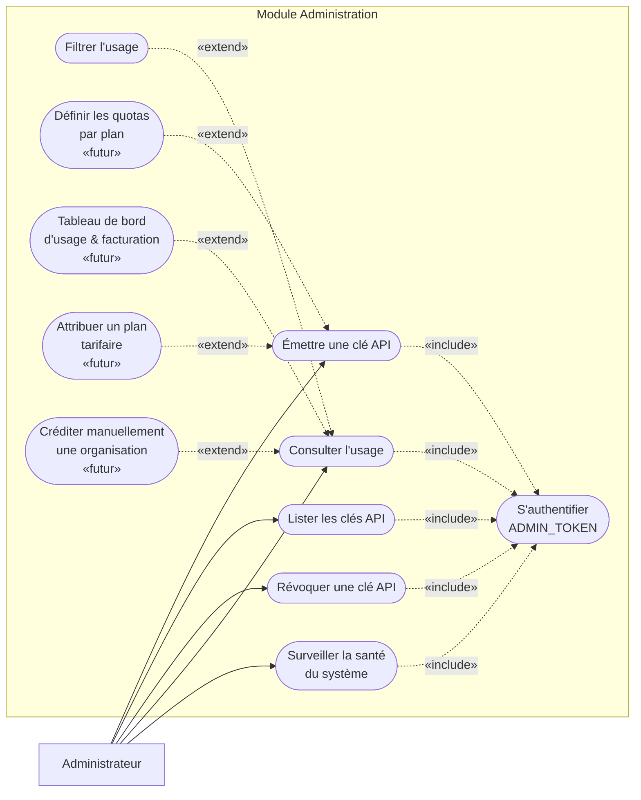
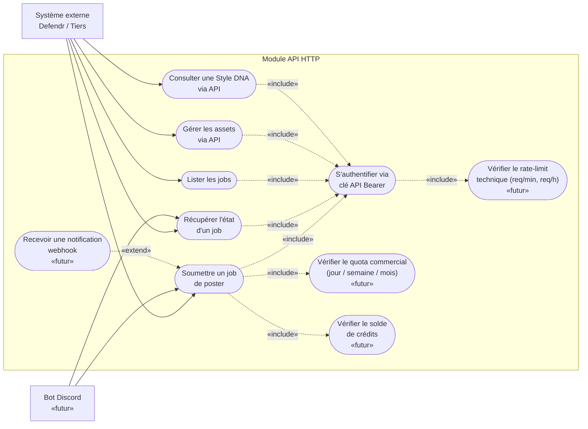
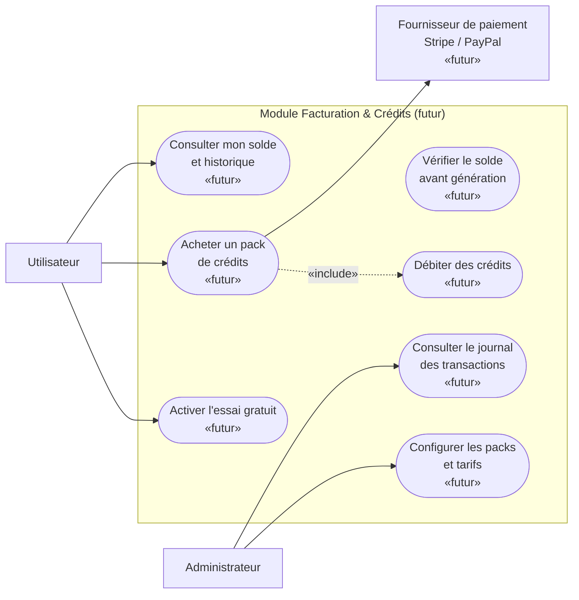

# Diagrammes de cas d'utilisation — EsportsPostAI

> Ce document constitue le chapitre **Conception — Diagrammes de cas d'utilisation** du rapport PFE. Il décrit l'ensemble des acteurs du système, les cas d'utilisation supportés (actuels et planifiés), et leurs relations UML pour chaque module fonctionnel.

---

## Table des matières

1. [Introduction et conventions](#1-introduction-et-conventions)
2. [Identification globale des acteurs](#2-identification-globale-des-acteurs)
3. [Diagramme global du système](#3-diagramme-global-du-systeme)
4. [Module — Génération de posters](#4-module--generation-de-posters)
5. [Module — Suivi & Consultation](#5-module--suivi--consultation)
6. [Module — Bibliothèque de marque](#6-module--bibliotheque-de-marque)
7. [Module — Style DNA](#7-module--style-dna)
8. [Module — Administration](#8-module--administration)
9. [Module — API HTTP](#9-module--api-http)
10. [Module — Facturation & Crédits *(futur)*](#10-module--facturation--credits-futur)
11. [Annexes — Légende UML et conventions](#11-annexes--legende-uml-et-conventions)

---

## 1. Introduction et conventions

### 1.1 Contexte

EsportsPostAI est une plateforme SaaS qui génère automatiquement des posters esports professionnels (League of Legends, Valorant) à partir d'un simple JSON décrivant le match ou l'événement. Le système combine :

- un pipeline d'IA en trois étapes *(background → prompt → image)*,
- une API HTTP avec file de jobs asynchrone *(FastAPI + RQ + Redis + MongoDB)*,
- un stockage objet *(Cloudflare R2)*,
- une interface Web React multi-tenant,
- des mécanismes de cohérence visuelle entre posters d'une même série *(Style DNA)*.

La modélisation par cas d'utilisation suit le standard **UML 2.5**. Chaque diagramme est restreint aux relations **`«include»`** et **`«extend»`** ; la généralisation n'est pas utilisée afin de garder une lecture simple pour le jury.

### 1.2 Conventions visuelles

| Élément | Forme dans le diagramme | Notation UML |
| --- | --- | --- |
| Acteur (humain ou système externe) | Rectangle (ou stick-figure UML après mise en forme) | Acteur |
| Cas d'utilisation | Ellipse / pilule | Use Case |
| Frontière du système | Grand rectangle englobant les cas d'utilisation | System Boundary |
| Relation d'association | Flèche pleine | trait plein entre acteur et UC |
| Relation `«include»` | Flèche pointillée du cas inclueur vers le cas inclus | `«include»` |
| Relation `«extend»` | Flèche pointillée du cas étendant vers le cas étendu | `«extend»` |
| Fonctionnalité planifiée | Stéréotype `«futur»` ajouté au label | — |

### 1.3 Statuts utilisés dans les tableaux

| Statut | Signification |
| --- | --- |
| **Actuel** | Fonctionnalité opérationnelle dans l'implémentation actuelle |
| **Futur** | Fonctionnalité planifiée dans la roadmap, marquée `«futur»` dans le diagramme |

---

## 2. Identification globale des acteurs

### 2.1 Acteurs principaux *(initient les cas d'utilisation)*

| Acteur | Type | Description du rôle | Canal d'accès au système |
| --- | --- | --- | --- |
| **Utilisateur** | Humain | Membre d'une organisation cliente (manager esports, créateur de contenu, designer). Pilote la création de posters, gère sa bibliothèque de marque, configure les Style DNA de ses tournois. | Interface Web React (SPA) ou ligne de commande Python |
| **Administrateur** | Humain | Exploitant du SaaS. Émet et révoque les clés API des organisations clientes, supervise l'usage, la santé du système et la grille tarifaire. | Endpoints d'administration protégés par `ADMIN_TOKEN` |
| **Système externe** | Logiciel | Application tierce qui consomme l'API HTTP en server-to-server. Defendr est le premier consommateur identifié ; toute autre plateforme esports peut s'intégrer via une clé API. | API REST `/v1/*` authentifiée par Bearer token |
| **Bot Discord** *(futur)* | Logiciel | Application cliente publiant des posters depuis une commande slash `/poster`. Cas particulier d'application tierce utilisant l'API publique. | API REST `/v1/*` |

### 2.2 Acteurs secondaires *(services externes invoqués par le système)*

| Acteur secondaire | Service rendu |
| --- | --- |
| **API OpenAI** | GPT-4o Vision (génération du prompt d'image et extraction sémantique du Style DNA) et gpt-image-2 (génération et édition d'images) |
| **Cloudflare R2** | Stockage objet S3-compatible pour les posters, les Style DNA, les assets de marque et les backgrounds système |
| **Runpod** *(stub, futur)* | Endpoint Stable Diffusion fine-tuné pour la génération de backgrounds par IA |
| **Fournisseur de paiement** *(futur)* | Stripe ou PayPal — traitement des achats de packs de crédits |

> **Note** : MongoDB et Redis ne sont pas modélisés comme acteurs car ils sont **internes** au périmètre du système. Seuls les services franchement externes (au-delà de la frontière de déploiement) apparaissent comme acteurs secondaires.

---

## 3. Diagramme global du système

### 3.1 Description

Le diagramme global présente une vue de haut niveau du système. Les six grands paquets de cas d'utilisation sont affichés ; le détail interne de chaque paquet est traité dans son sous-diagramme dédié *(sections 4 à 10)*.

### 3.2 Acteurs impliqués

| Acteur | Type | Cas d'utilisation principaux |
| --- | --- | --- |
| Utilisateur | Principal | Tous les modules métier (Génération, Suivi, Brand Library, Style DNA) |
| Administrateur | Principal | Administration de la plateforme |
| Système externe (Defendr / Tiers) | Principal | Toutes les opérations également disponibles à l'Utilisateur, via API |
| API OpenAI | Secondaire | Invoqué par Génération de posters et par Style DNA |
| Cloudflare R2 | Secondaire | Invoqué par Génération, Brand Library, Style DNA |
| Runpod | Secondaire *(futur)* | Invoqué optionnellement par Génération si `background.source = "generated"` |

### 3.3 Cas d'utilisation de haut niveau

| Code | Cas d'utilisation | Description | Statut |
| --- | --- | --- | --- |
| **G-AUTH** | S'authentifier | Mécanisme d'identification commun à tous les flux. Pour l'Utilisateur : session Web. Pour le Système externe : Bearer token. Pour l'Administrateur : `ADMIN_TOKEN`. | Actuel |
| **G-BL** | Gérer la bibliothèque de marque | Paquet regroupant l'upload, le listing, le filtrage et la suppression des assets visuels de l'organisation. | Actuel |
| **G-GEN** | Générer un poster | Paquet regroupant la soumission d'un poster, le choix du mode (fresh / consistency / refine), la configuration et la génération de l'image finale. | Actuel |
| **G-TRACK** | Suivre et consulter les posters | Paquet regroupant le tableau de bord, le suivi en temps réel des jobs, la consultation des posters terminés et l'historique. | Actuel |
| **G-DNA** | Gérer le Style DNA | Paquet regroupant l'extraction, l'édition, l'approbation et la suppression des empreintes visuelles de tournoi. | Actuel |
| **G-ADM** | Administrer la plateforme | Paquet regroupant la gestion des clés API, le suivi de l'usage et la supervision du système. | Actuel |

### 3.4 Relations globales

| Source | Stéréotype | Cible | Commentaire |
| --- | --- | --- | --- |
| G-GEN, G-BL, G-DNA, G-ADM | `«include»` | G-AUTH | Toute opération métier requiert une authentification valide |

### 3.5 Code Mermaid

---

## 4. Module — Génération de posters

### 4.1 Description

Ce module concentre la fonctionnalité cœur du SaaS : la soumission d'une demande de poster, la sélection du mode (fresh / consistency / refine), la saisie des données, le choix du format et du background, puis la génération effective de l'image. Le module communique avec OpenAI pour la génération, avec R2 pour la lecture des assets et la persistance du poster, et optionnellement avec Runpod pour la génération de backgrounds par IA.

### 4.2 Acteurs impliqués

| Acteur | Type | Rôle dans ce module |
| --- | --- | --- |
| Utilisateur | Principal | Saisit les données du poster via l'assistant Web ou la CLI, déclenche la soumission |
| Système externe | Principal | Soumet un job de poster en server-to-server *(JSON inline)* |
| API OpenAI | Secondaire | Invoqué pour générer le prompt d'image (GPT-4o) et l'image finale (gpt-image-2) |
| Cloudflare R2 | Secondaire | Lecture des assets référencés (logos, photos), persistance du poster terminé |
| Runpod | Secondaire *(futur)* | Génération du background par Stable Diffusion fine-tuné quand `background.source = "generated"` |

### 4.3 Cas d'utilisation

| Code | Cas d'utilisation | Description détaillée | Acteur(s) | Statut |
| --- | --- | --- | --- | --- |
| **UC-G01** | Soumettre un poster | Cas central du module. L'utilisateur ou un système externe envoie une demande de poster (JSON validé par `PosterInput`). Le système enregistre le job en file et renvoie un identifiant de job dans la seconde. Le mode (fresh / consistency / refine) est encodé dans `_meta.mode`. | Utilisateur, Système externe | Actuel |
| **UC-G02** | Saisir les données | Renseignement des informations factuelles du poster : équipes, score, joueurs, tournoi, date, heure, stream URL, choix de design (vibe, couleur, énergie). Côté Web, géré par un assistant en cinq étapes contrôlées. | Utilisateur | Actuel |
| **UC-G03** | Choisir le type de poster | Sélection parmi les cinq types disponibles par jeu : *gameday*, *game_results*, *roster_reveal*, *tournament_announcement*, *tournament_banner*. Détermine le builder de bloc METADATA appliqué. | Utilisateur | Actuel |
| **UC-G04** | Choisir le format de sortie | Sélection du format final : portrait 1080×1920, carré 1080×1080, ou paysage 1920×1080. | Utilisateur | Actuel |
| **UC-G05** | Choisir la source du background | Sélection entre trois sources : upload utilisateur (local ou clé R2), pool système (sélection alphabétique), ou génération IA via Runpod. La priorité est codée dans `stages/background.py`. | Utilisateur | Actuel |
| **UC-G06** | Générer l'image finale | Orchestration des étapes du pipeline : sélection du background, génération du prompt d'image (GPT-4o), génération de l'image (gpt-image-2 edit mode), composition optionnelle de la barre des sponsors, sauvegarde double (local + R2). | Système (worker) | Actuel |
| **UC-G07** | Appliquer une Style DNA approuvée | Quand le mode est *consistency*, le système charge la Style DNA approuvée du tournoi depuis R2 et l'injecte comme contrainte dans le prompt d'image (palette, atmosphère, lumière, particules). | Utilisateur, Système externe | Actuel |
| **UC-G08** | Affiner depuis un poster parent | Quand le mode est *refine*, le système récupère un poster déjà généré depuis R2 et le passe comme canvas à gpt-image-2 en mode édition, avec un prompt freeform fourni par l'utilisateur. | Utilisateur | Actuel |
| **UC-G09** | Configurer la barre des sponsors | Optionnellement, l'utilisateur active la composition d'une barre de sponsors (logos, opacité dynamique, ratio fixe). Géré par PIL après la génération de l'image. | Utilisateur | Actuel |
| **UC-G10** | Estimer le coût | À l'étape 5 de l'assistant Web, un estimateur calcule en temps réel le coût (en EUR) du futur poster selon le format, le nombre de logos / joueurs / MVP, la présence d'un Style DNA, le vibe, l'énergie. | Utilisateur | Actuel |
| **UC-G11** | Sauvegarder un brouillon de formulaire | À chaque modification du formulaire, l'état (champs + étape courante) est persisté dans `localStorage` (clé `epai_wizard_draft_v1`). Permet la reprise après rafraîchissement. Les champs éphémères (DNA chargée, bibliothèques) sont exclus. | Utilisateur | Actuel |
| **UC-G12** | Générer plusieurs variantes (brouillons) `«futur»` | Mode de génération multi-sorties à `quality="low"` permettant à l'utilisateur de choisir parmi N candidats avant de générer la version finale à `quality="medium"`. Cible : réduire le coût des rejets. | Utilisateur | Futur |
| **UC-G13** | Régénérer depuis des données éditées `«futur»` | Variante de refine : l'utilisateur édite le JSON d'entrée d'un poster parent, le pipeline est entièrement ré-exécuté en mode consistency sous la Style DNA du parent. Chemin fiable pour corriger des données factuelles (score, date, noms). | Utilisateur | Futur |

### 4.4 Relations

| Source | Stéréotype | Cible | Condition / déclencheur |
| --- | --- | --- | --- |
| UC-G01 *Soumettre un poster* | `«include»` | UC-G02 *Saisir les données* | Toujours |
| UC-G01 | `«include»` | UC-G03 *Choisir le type* | Toujours |
| UC-G01 | `«include»` | UC-G04 *Choisir le format* | Toujours |
| UC-G01 | `«include»` | UC-G05 *Choisir la source du background* | Toujours |
| UC-G01 | `«include»` | UC-G06 *Générer l'image finale* | Toujours |
| UC-G07 *Appliquer Style DNA approuvée* | `«extend»` | UC-G01 | `_meta.mode = "consistency"` et une DNA approuvée existe pour le tournoi |
| UC-G08 *Affiner depuis un poster parent* | `«extend»` | UC-G01 | `_meta.mode = "refine"` et `parent_storage_key` fourni |
| UC-G09 *Configurer la barre des sponsors* | `«extend»` | UC-G01 | `sponsors.enabled = true` dans le JSON d'entrée |
| UC-G10 *Estimer le coût* | `«extend»` | UC-G02 | Interface Web — étape 5 de l'assistant atteinte |
| UC-G11 *Sauvegarder un brouillon* | `«extend»` | UC-G02 | Interface Web — déclenchement automatique à chaque modification |
| UC-G12 *Générer plusieurs variantes* `«futur»` | `«extend»` | UC-G01 | `_meta.preview_mode = true` (à définir) |
| UC-G13 *Régénérer depuis données éditées* `«futur»` | `«extend»` | UC-G01 | Déclenchement depuis la page Résultat d'un poster parent |

### 4.5 Code Mermaid

---

## 5. Module — Suivi & Consultation

### 5.1 Description

Ce module couvre tout ce qui se passe **après** la soumission d'un job : la consultation du tableau de bord, le suivi en temps réel de l'avancement (polling de l'état), l'affichage du poster final, le téléchargement, le partage et la navigation dans l'historique. Il sert également de point de jonction vers d'autres modules (extraction de Style DNA, refine).

### 5.2 Acteurs impliqués

| Acteur | Type | Rôle dans ce module |
| --- | --- | --- |
| Utilisateur | Principal | Consulte le tableau de bord, suit les jobs, télécharge et partage ses posters |
| Système externe | Principal | Poll l'état d'un job et récupère le poster terminé via API |
| Cloudflare R2 | Secondaire | Signature d'URL pour l'affichage et le téléchargement |

### 5.3 Cas d'utilisation

| Code | Cas d'utilisation | Description détaillée | Acteur(s) | Statut |
| --- | --- | --- | --- | --- |
| **UC-S01** | Consulter le tableau de bord | Page d'accueil après connexion. Polling de `GET /v1/posters` toutes les 5 s. Affiche les jobs en cours (anneau de progression) et les posters récents (miniatures cliquables), avec quelques statistiques d'usage live. | Utilisateur | Actuel |
| **UC-S02** | Suivre l'avancement d'un job | Page dédiée à un job spécifique (`#/job/{job_id}`). Polling de `GET /v1/posters/{job_id}` toutes les 2 s. Mappe l'état backend (`queued`, `generating_prompt`, `generating_poster`, `applying_sponsor_bar`, `completed`, `failed`) sur une visualisation par étape. Auto-redirige vers le résultat sur `completed`. | Utilisateur, Système externe | Actuel |
| **UC-S03** | Consulter le poster final | Page Résultat (`#/result/{job_id}`). Affiche l'image rendue depuis l'URL R2 signée, avec les actions disponibles (télécharger, partager, extraire DNA, raffiner). | Utilisateur, Système externe | Actuel |
| **UC-S04** | Télécharger le poster | Téléchargement direct du PNG depuis l'URL signée R2. | Utilisateur | Actuel |
| **UC-S05** | Copier le lien de partage | Copie l'URL signée R2 dans le presse-papiers pour partage manuel. | Utilisateur | Actuel |
| **UC-S06** | Consulter l'historique | Page Historique (`#/history`). Polling de `GET /v1/posters` toutes les 8 s. Liste paginée de tous les posters de l'organisation. | Utilisateur | Actuel |
| **UC-S07** | Filtrer et rechercher dans l'historique | Onglets de statut *(All / Completed / In progress / Failed)*, sélecteur de tournoi, barre de recherche textuelle. | Utilisateur | Actuel |
| **UC-S08** | Récupérer le statut du job | Cas d'utilisation interne : lecture de l'état d'un job dans le `JobStore` (MongoDB), ou via l'endpoint REST. | Système (worker, API) | Actuel |
| **UC-S09** | Signer l'URL R2 | Génération d'une URL pré-signée par boto3 vers l'objet stocké dans R2, valide pour une durée limitée. | Système (API) | Actuel |
| **UC-S10** | Partager sur réseaux sociaux `«futur»` | Boutons natifs sur la page Résultat pour X, Instagram, TikTok, Discord, Telegram. Utilise les Share APIs natives quand disponibles, ou ouvre un compose intent prérempli sinon. | Utilisateur | Futur |

### 5.4 Relations

| Source | Stéréotype | Cible | Condition / déclencheur |
| --- | --- | --- | --- |
| UC-S02 *Suivre l'avancement* | `«include»` | UC-S08 *Récupérer le statut* | Toujours |
| UC-S03 *Consulter le poster final* | `«include»` | UC-S09 *Signer l'URL R2* | Toujours |
| UC-S04 *Télécharger* | `«extend»` | UC-S03 | Le job est complété avec succès |
| UC-S05 *Copier le lien* | `«extend»` | UC-S03 | Le job est complété avec succès |
| UC-S07 *Filtrer et rechercher* | `«extend»` | UC-S06 | Au moins un filtre ou recherche actif |
| UC-S10 *Partager sur réseaux sociaux* `«futur»` | `«extend»` | UC-S03 | Fonctionnalité activée |

### 5.5 Code Mermaid

---

## 6. Module — Bibliothèque de marque

### 6.1 Description

La bibliothèque de marque permet à une organisation d'uploader, de cataloguer et de gérer ses assets visuels réutilisables : logos d'équipes, photos de joueurs, logos de sponsors, logos de tournois, backgrounds personnalisés. Les assets sont **org-scoped** : un logo téléversé une fois est réutilisable dans tous les tournois de l'organisation.

### 6.2 Acteurs impliqués

| Acteur | Type | Rôle dans ce module |
| --- | --- | --- |
| Utilisateur | Principal | Téléverse, liste, filtre et supprime les assets via la page *Brand Library* du SPA |
| Système externe | Principal | Téléverse et gère les assets par API en server-to-server |
| Cloudflare R2 | Secondaire | Stockage des bytes, signature d'URL pour l'affichage |

### 6.3 Cas d'utilisation

| Code | Cas d'utilisation | Description détaillée | Acteur(s) | Statut |
| --- | --- | --- | --- | --- |
| **UC-B01** | Uploader un asset | Endpoint `POST /v1/assets` (multipart). Reçoit `org_id`, `asset_type` (`team-logos`, `player-images`, `sponsor-logos`, `tournament-logos`, `background`), le fichier et éventuellement le nom et l'équipe. Persiste les bytes dans R2 et l'enregistrement dans MongoDB. Retourne `{asset_id, storage_key, signed_url}`. | Utilisateur, Système externe | Actuel |
| **UC-B02** | Lister les assets | Endpoint `GET /v1/assets?org_id=&asset_type=&team=&limit=`. Retourne la collection d'assets filtrée et paginée, avec une URL signée par item. | Utilisateur, Système externe | Actuel |
| **UC-B03** | Filtrer par type et équipe | Application des filtres `asset_type` et `team` sur le listing. Côté UI : onglets par type et sélecteur d'équipe. | Utilisateur | Actuel |
| **UC-B04** | Supprimer un asset | Endpoint `DELETE /v1/assets/{asset_id}`. Supprime l'objet R2 et l'enregistrement Mongo correspondant (soft-delete via flag). | Utilisateur, Système externe | Actuel |
| **UC-B05** | Sélection rapide d'un logo | Dans l'assistant de création de poster, les chips d'équipe sont alimentés par les assets `team-logos` existants (dédupliqués par token d'équipe). Clic = remplissage automatique du formulaire (nom + short + logo). | Utilisateur | Actuel |
| **UC-B06** | Supprimer l'arrière-plan (rembg + u2netp) | Pipeline d'image automatique à l'upload : appelle `rembg` avec le modèle léger `u2netp` (~4.7 Mo, 1-2 s sur CPU) pour rendre le fond transparent. Activé par défaut sur logos et joueurs ; ignoré si alpha déjà présent ; fallback à l'original sur erreur. | Système | Actuel |
| **UC-B07** | Redimensionner l'image | Pipeline d'image automatique : applique `LOGO_MAX_DIM=512` pour les logos et `PLAYER_MAX_DIM=1024` pour les photos, avec préservation du ratio. | Système | Actuel |
| **UC-B08** | Garantir un seul logo par équipe | Règle métier : à l'upload d'un `team-logo` pour une équipe ayant déjà un logo, l'ancien asset est supprimé (R2 + Mongo) avant l'insertion du nouveau. | Système | Actuel |

### 6.4 Relations

| Source | Stéréotype | Cible | Condition / déclencheur |
| --- | --- | --- | --- |
| UC-B01 *Uploader un asset* | `«include»` | UC-B07 *Redimensionner l'image* | Toujours (le redimensionnement est systématique) |
| UC-B05 *Sélection rapide* | `«include»` | UC-B02 *Lister les assets* | Toujours (la liste alimente les chips) |
| UC-B06 *Supprimer l'arrière-plan* | `«extend»` | UC-B01 | Option *« Remove background »* cochée à l'upload (par défaut activée pour logos et joueurs) |
| UC-B08 *Un logo par équipe* | `«extend»` | UC-B01 | `asset_type = team-logo` et un logo existe déjà pour cette équipe |
| UC-B03 *Filtrer* | `«extend»` | UC-B02 | Au moins un filtre actif |

### 6.5 Code Mermaid

---

## 7. Module — Style DNA

### 7.1 Description

Le Style DNA capture l'**identité visuelle** d'un poster approuvé (palette, atmosphère, lumière, particules) sans capturer son **contenu** (noms d'équipes, scores, dates). Il sert à garantir la cohérence visuelle de tous les posters d'une même série de tournoi. Le module gère un cycle de vie en deux états : *brouillon* (modifiable) et *approuvé* (utilisé par les générations en mode consistency).

### 7.2 Acteurs impliqués

| Acteur | Type | Rôle dans ce module |
| --- | --- | --- |
| Utilisateur | Principal | Extrait, édite, approuve et supprime les Style DNA de ses tournois |
| API OpenAI | Secondaire | Invoqué pour l'extraction sémantique (lumière, atmosphère, énergie, particules) via GPT-4o Vision |
| Cloudflare R2 | Secondaire | Persistance des objets brouillon et approuvé |

### 7.3 Cas d'utilisation

| Code | Cas d'utilisation | Description détaillée | Acteur(s) | Statut |
| --- | --- | --- | --- | --- |
| **UC-D01** | Extraire une Style DNA brouillon | Depuis un poster approuvé, lance une extraction hybride. Le résultat est sauvegardé comme brouillon (`style-dna.draft.json`) dans R2, lié à `org_id` + `tournament_id`. | Utilisateur | Actuel |
| **UC-D02** | Extraire la palette (PIL) | Extraction programmatique des couleurs dominantes via quantification médiane PIL. Retourne des hex sortis par fréquence. Déterministe, gratuit, précis. | Système | Actuel |
| **UC-D03** | Extraire les attributs sémantiques (GPT-4o) | Appel GPT-4o Vision avec le poster et la palette déjà extraite comme référence. Retourne lumière, atmosphère, énergie, particules, mots-clés de style SD. Le prompt interdit la fuite de contenu factuel. | Système | Actuel |
| **UC-D04** | Consulter une Style DNA | Endpoint `GET /v1/style-dnas/{tournament_id}?status=`. Retourne l'objet (brouillon, approuvée ou les deux) avec une URL signée vers le poster source. | Utilisateur | Actuel |
| **UC-D05** | Éditer le brouillon | Endpoint `PUT /v1/style-dnas/{tournament_id}`. L'utilisateur peut ajuster manuellement les champs sémantiques avant approbation. | Utilisateur | Actuel |
| **UC-D06** | Approuver la Style DNA | Endpoint `POST /v1/style-dnas/{tournament_id}/approve`. Promote le brouillon en objet approuvé (`style-dna.json`), supprime le brouillon, ajoute un horodatage `approved_at`. | Utilisateur | Actuel |
| **UC-D07** | Supprimer une Style DNA | Endpoint `DELETE /v1/style-dnas/{tournament_id}`. Supprime les deux objets (brouillon + approuvé) du tournoi. | Utilisateur | Actuel |
| **UC-D08** | Consulter la galerie des DNA | Section du dashboard qui découvre toutes les Style DNA sauvegardées de l'organisation à partir des jobs de tournoi. Affiche palette, badge de statut, poster source, résumé énergie/lumière. | Utilisateur | Actuel |
| **UC-D09** | Supprimer le brouillon | Cas interne déclenché après une approbation : assure qu'un seul objet par tournoi reste après promotion. | Système | Actuel |
| **UC-D10** | Masquer le contenu textuel (OCR) `«futur»` | Avant l'appel sémantique à GPT-4o, on détecte les régions textuelles du poster via OCR et on les masque (ou on les passe comme bounding-boxes à ignorer). Empêche toute fuite résiduelle de noms / scores dans la DNA extraite. | Système | Futur |

### 7.4 Relations

| Source | Stéréotype | Cible | Condition / déclencheur |
| --- | --- | --- | --- |
| UC-D01 *Extraire DNA brouillon* | `«include»` | UC-D02 *Extraire la palette* | Toujours |
| UC-D01 | `«include»` | UC-D03 *Extraire les attributs sémantiques* | Toujours |
| UC-D06 *Approuver* | `«include»` | UC-D09 *Supprimer le brouillon* | Toujours |
| UC-D03 *Extraire attributs sémantiques* | `«include»` | UC-D10 *Masquer le contenu textuel (OCR)* `«futur»` | Quand la fonctionnalité OCR est activée |
| UC-D05 *Éditer le brouillon* | `«extend»` | UC-D04 *Consulter une DNA* | Statut = `draft` |
| UC-D06 *Approuver* | `«extend»` | UC-D04 | Statut = `draft` |

### 7.5 Code Mermaid

---

## 8. Module — Administration

### 8.1 Description

Ce module regroupe les fonctionnalités réservées à l'exploitant du SaaS : émission et révocation des clés API par organisation, supervision de l'usage et de la facturation, surveillance de la santé du système, et (en futur) configuration des plans tarifaires et quotas. Toutes ces opérations sont protégées par un token d'administration (`ADMIN_TOKEN`).

### 8.2 Acteurs impliqués

| Acteur | Type | Rôle dans ce module |
| --- | --- | --- |
| Administrateur | Principal | Détient l'`ADMIN_TOKEN`, pilote la gestion multi-tenant |

### 8.3 Cas d'utilisation

| Code | Cas d'utilisation | Description détaillée | Acteur(s) | Statut |
| --- | --- | --- | --- | --- |
| **UC-A01** | S'authentifier (ADMIN_TOKEN) | Vérification du header `Authorization: Bearer <ADMIN_TOKEN>` contre `Settings.admin_token`. Si le token est vide ou incorrect, toutes les routes admin renvoient `401`. | Administrateur | Actuel |
| **UC-A02** | Émettre une clé API | Endpoint `POST /v1/api-keys`. Génère une clé aléatoire, en stocke le hash, renvoie le plaintext **une seule fois** à l'admin pour transmission au client. | Administrateur | Actuel |
| **UC-A03** | Lister les clés API | Endpoint `GET /v1/api-keys`. Retourne les métadonnées des clés (id, org_id, date de création, statut) sans le plaintext. | Administrateur | Actuel |
| **UC-A04** | Révoquer une clé API | Endpoint `DELETE /v1/api-keys/{key_id}`. Marque la clé comme révoquée. Les requêtes ultérieures avec cette clé seront refusées. | Administrateur | Actuel |
| **UC-A05** | Consulter l'usage | Endpoint `GET /v1/usage`. Retourne le nombre de jobs et le coût estimé sur une période, optionnellement par organisation. Basé sur la collection `usage_events` + `cost_per_poster_usd`. | Administrateur | Actuel |
| **UC-A06** | Filtrer l'usage | Filtres `org_id`, `period_start`, `period_end` sur le précédent. | Administrateur | Actuel |
| **UC-A07** | Surveiller la santé du système | Endpoint `GET /health`. Renvoie `{status, mongodb, redis}` — `503` si l'un des deux est inaccessible. Permet à l'UI d'afficher un pill *« backend unreachable »*. | Administrateur | Actuel |
| **UC-A08** | Définir les quotas par plan `«futur»` | Configuration des limites par plan tarifaire (X posters/jour, Y/semaine, Z/mois). Les quotas sont vérifiés à chaque soumission. | Administrateur | Futur |
| **UC-A09** | Tableau de bord d'usage & facturation `«futur»` | Vue agrégée par organisation et par période : posters réalisés, taux de succès, dépense estimée, tokens consommés par étape de pipeline. Route `#/admin/usage`. | Administrateur | Futur |
| **UC-A10** | Attribuer un plan tarifaire `«futur»` | Association d'une organisation à un plan (Free / Pay-as-you-go / Pro / Enterprise) avec ses quotas et son mode de facturation. | Administrateur | Futur |
| **UC-A11** | Créditer manuellement une organisation `«futur»` | Geste commercial : crédite N crédits gratuits à une org (gestes de fidélisation, compensations, partenariats). Une entrée est ajoutée au journal des transactions. | Administrateur | Futur |

### 8.4 Relations

| Source | Stéréotype | Cible | Condition / déclencheur |
| --- | --- | --- | --- |
| UC-A02 à UC-A05, UC-A07 | `«include»` | UC-A01 *S'authentifier* | Toujours |
| UC-A06 *Filtrer l'usage* | `«extend»` | UC-A05 | Au moins un filtre actif |
| UC-A08 *Définir les quotas* `«futur»` | `«extend»` | UC-A02 | Plan tarifaire à configurer |
| UC-A09 *Dashboard usage & facturation* `«futur»` | `«extend»` | UC-A05 | Navigation vers `#/admin/usage` |
| UC-A10 *Attribuer un plan* `«futur»` | `«extend»` | UC-A02 | Nouvelle organisation onboardée |
| UC-A11 *Créditer manuellement* `«futur»` | `«extend»` | UC-A05 | Décision commerciale |

### 8.5 Code Mermaid

---

## 9. Module — API HTTP

### 9.1 Description

Ce module formalise le canal de consommation server-to-server de la plateforme. Tout système client (Defendr, bot Discord futur, intégration tierce) y accède via les endpoints `/v1/*` avec une clé API en Bearer token. Le module est responsable de l'authentification de l'appelant, de la vérification des quotas et limites (techniques et commerciales) et de l'enqueue des jobs.

### 9.2 Acteurs impliqués

| Acteur | Type | Rôle dans ce module |
| --- | --- | --- |
| Système externe (Defendr / Tiers) | Principal | Consommateur principal de l'API en mode automatisé |
| Bot Discord *(futur)* | Principal | Cas particulier d'application cliente — commande slash `/poster` qui appelle l'API |

### 9.3 Cas d'utilisation

| Code | Cas d'utilisation | Description détaillée | Acteur(s) | Statut |
| --- | --- | --- | --- | --- |
| **UC-E01** | S'authentifier via clé API (Bearer) | Vérification du header `Authorization: Bearer <api_key>`. Le hash de la clé est recherché dans la collection `api_keys`. Échec → `401`. Succès → `org_id` injecté dans le contexte de la requête. | Système externe, Bot Discord | Actuel *(middleware en cours)* |
| **UC-E02** | Soumettre un job de poster | Endpoint `POST /v1/posters`. Reçoit `{org_id, tournament_id, input}`. Valide l'input via `PosterInput`. Enqueue le job dans RQ. Retourne `{job_id, status: queued}` immédiatement. | Système externe, Bot Discord | Actuel |
| **UC-E03** | Récupérer l'état d'un job | Endpoint `GET /v1/posters/{job_id}`. Retourne le statut courant ainsi que, si complété, une URL signée vers le poster final. | Système externe, Bot Discord | Actuel |
| **UC-E04** | Lister les jobs | Endpoint `GET /v1/posters?org_id=&tournament_id=&limit=`. Liste paginée la plus récente d'abord. | Système externe | Actuel |
| **UC-E05** | Gérer les assets via API | Suite d'endpoints `/v1/assets` *(POST / GET / DELETE)* — équivalents API de la bibliothèque de marque côté UI. | Système externe | Actuel |
| **UC-E06** | Consulter une Style DNA via API | Endpoint `GET /v1/style-dnas/{tournament_id}`. Permet à un client externe de vérifier la cohérence visuelle prévue pour un tournoi. | Système externe | Actuel |
| **UC-E07** | Recevoir une notification webhook `«futur»` | À la fin d'un job, le système POST une notification HTTP vers l'URL fournie par le client à la soumission (`webhook_url`). Avec retries exponentiels et signature HMAC. | Système externe | Futur |
| **UC-E08** | Vérifier le rate-limit technique `«futur»` | Token bucket Redis keyé par `org_id` et par clé API : N requêtes/min, M requêtes/h. Anti-abus. Renvoie `429` + header `Retry-After`. | Système | Futur |
| **UC-E09** | Vérifier le quota commercial `«futur»` | Limite contractuelle liée au plan de l'org : X posters/jour, Y/semaine, Z/mois. Renvoie `402 Payment Required` ou `429` selon la cause. | Système | Futur |
| **UC-E10** | Vérifier le solde de crédits `«futur»` | Avant d'enqueue, le système vérifie que le wallet de crédits de l'org est suffisant. Sinon, renvoie `402 Payment Required` avec un lien d'achat. | Système | Futur |

### 9.4 Relations

| Source | Stéréotype | Cible | Condition / déclencheur |
| --- | --- | --- | --- |
| UC-E02 à UC-E06 | `«include»` | UC-E01 *S'authentifier* | Toujours |
| UC-E01 *S'authentifier* | `«include»` | UC-E08 *Rate-limit technique* `«futur»` | Toujours (vérifié immédiatement après l'auth) |
| UC-E02 *Soumettre un job* | `«include»` | UC-E09 *Quota commercial* `«futur»` | Toujours |
| UC-E02 | `«include»` | UC-E10 *Solde de crédits* `«futur»` | Toujours |
| UC-E07 *Webhook* `«futur»` | `«extend»` | UC-E02 | `webhook_url` fourni dans la soumission |

### 9.5 Code Mermaid

---

## 10. Module — Facturation & Crédits *(futur)*

### 10.1 Description

Ce module formalise la **monétisation** de la plateforme. Il introduit les notions de portefeuille de crédits, d'essai gratuit, d'achat de packs prépayés et de débit à la consommation. Il s'appuie sur un fournisseur de paiement externe (Stripe ou PayPal) et alimente la couche de vérification du quota commercial décrite dans le module API HTTP.

> **Note stratégique** : ce module repose sur le choix d'une **clé OpenAI centralisée** (gérée par la plateforme, pas par chaque client). Ce choix permet à la plateforme de proposer un essai gratuit et des crédits prépayés ; un mode BYOK (*Bring Your Own Key*) pourra être proposé ultérieurement aux comptes Enterprise.

### 10.2 Acteurs impliqués

| Acteur | Type | Rôle dans ce module |
| --- | --- | --- |
| Utilisateur | Principal | Active son essai gratuit, achète des packs de crédits, consulte son solde |
| Administrateur | Principal | Configure les packs tarifaires, consulte le journal des transactions, accorde des crédits manuels |
| Fournisseur de paiement *(Stripe / PayPal)* | Secondaire | Traite les transactions d'achat, renvoie un webhook de confirmation |

### 10.3 Cas d'utilisation

| Code | Cas d'utilisation | Description détaillée | Acteur(s) | Statut |
| --- | --- | --- | --- | --- |
| **UC-F01** | Activer l'essai gratuit | À l'inscription, l'utilisateur déclenche son essai (N crédits offerts, une seule fois par organisation). Le wallet est initialisé avec un solde non nul et un flag `trial_used = true`. | Utilisateur | Futur |
| **UC-F02** | Acheter un pack de crédits | L'utilisateur sélectionne un pack (10 / 50 / 200 / 500 crédits) et est redirigé vers la page de paiement Stripe / PayPal. À confirmation, le wallet est crédité du nombre correspondant. | Utilisateur | Futur |
| **UC-F03** | Consulter mon solde et historique | Page dédiée affichant le solde actuel du wallet, les achats récents et la consommation par poster. | Utilisateur | Futur |
| **UC-F04** | Vérifier le solde avant génération | Cas système invoqué par le module API HTTP avant chaque enqueue. Si le solde est insuffisant, l'API renvoie `402 Payment Required`. | Système | Futur |
| **UC-F05** | Débiter des crédits | Cas système invoqué à la fin réussie d'un job. Décrémente le wallet du coût du poster (1 crédit par défaut, configurable selon le format / la qualité). Ajoute une entrée au journal. | Système | Futur |
| **UC-F06** | Configurer les packs et tarifs | L'administrateur définit les packs disponibles, leur prix en EUR et le nombre de crédits qu'ils contiennent. | Administrateur | Futur |
| **UC-F07** | Consulter le journal des transactions | L'administrateur accède à la liste complète des achats, débits et crédits manuels, filtrable par organisation et période. | Administrateur | Futur |

### 10.4 Relations

| Source | Stéréotype | Cible | Condition / déclencheur |
| --- | --- | --- | --- |
| UC-F02 *Acheter un pack* | `«include»` | UC-F05 *Débiter des crédits* | Non — l'achat crédite ; le débit se fait à la consommation |
| UC-F02 | *(association)* | Fournisseur de paiement | Toujours (redirection vers Stripe / PayPal) |

> Les cas **UC-F04** *Vérifier le solde* et **UC-F05** *Débiter des crédits* sont **invoqués transversalement** depuis le module API HTTP (UC-E10) et depuis le worker à la fin d'un job. Ils ne sont pas associés à un acteur humain direct.

### 10.5 Code Mermaid

---

## 11. Annexes — Légende UML et conventions

### 11.1 Stéréotypes utilisés

| Stéréotype | Notation | Sémantique |
| --- | --- | --- |
| `«include»` | flèche pointillée de A vers B | A utilise **systématiquement** B dans son flux nominal. La présence de B est obligatoire. |
| `«extend»` | flèche pointillée de B vers A | B étend A **sous une condition** (étiquetée sur la flèche ou décrite dans le tableau de relations). Le flux nominal de A ne dépend pas de B. |
| `«futur»` | suffixe ajouté au label | Convention non-standard introduite pour ce rapport : signale qu'un cas d'utilisation est dans la roadmap mais pas encore implémenté. |

### 11.2 Conventions visuelles recommandées dans draw.io

| Élément | Style suggéré |
| --- | --- |
| Cas d'utilisation actuel | Ellipse, fond `#1BA1E2`, texte blanc, bordure noire |
| Cas d'utilisation futur (`«futur»`) | Ellipse, fond `#E5E5E5`, bordure noire **pointillée**, texte noir |
| Acteur humain | Stick figure UML (`shape=umlActor`), label en-dessous |
| Acteur logiciel / système externe | Rectangle blanc, bordure noire, texte noir |
| Frontière du système | Grand rectangle blanc, bordure noire, label en haut à gauche |
| Flèche d'association | Trait plein noir |
| Flèche `«include»` / `«extend»` | Trait pointillé noir avec label au milieu |

### 11.3 Récapitulatif des codes de cas d'utilisation

| Préfixe | Module |
| --- | --- |
| **UC-G** | Génération de posters |
| **UC-S** | Suivi & Consultation |
| **UC-B** | Bibliothèque de marque |
| **UC-D** | Style DNA |
| **UC-A** | Administration |
| **UC-E** | API HTTP (système externe) |
| **UC-F** | Facturation & Crédits *(futur)* |

### 11.4 Lien avec la roadmap du projet

| Phase de la roadmap | Modules concernés |
| --- | --- |
| Phase 1 — Reliability hardening | Génération (PIL text overlay, fallback qualité), Style DNA (OCR masking) |
| Phase 2 — Storage abstraction ✅ | Brand Library, Génération, Style DNA |
| Phase 3 — Async job pipeline ✅ | Suivi, Génération |
| Phase 4 — HTTP API ✅ | API HTTP, tous les modules métier |
| Phase 5 — Multi-tenancy (en cours) | Administration, API HTTP |
| Phase 6 — Defendr integration | API HTTP, Webhook (UC-E07) |
| **Phase 7 — Monétisation** *(nouvelle)* | Facturation & Crédits, rate-limit et quotas dans API HTTP, plans dans Administration |

---

*Fin du document — Diagrammes de cas d'utilisation*
